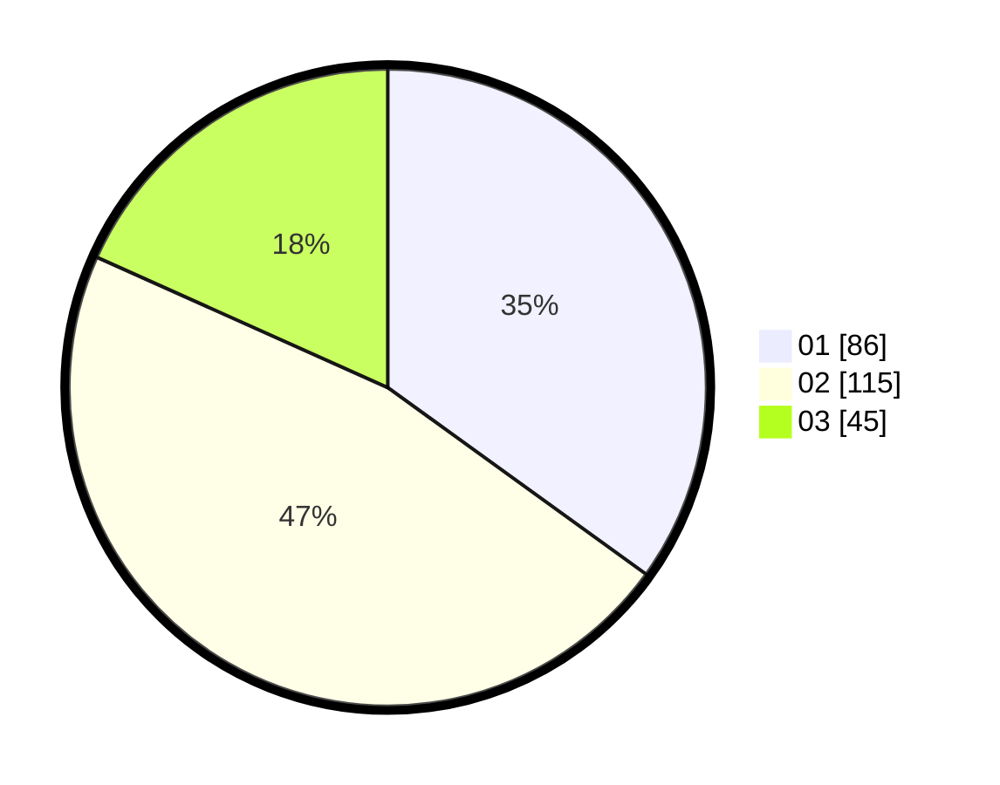

# Hasil

Hasil perolehan suara paslon dapat dilihat pada file paslon-01.txt, paslon-02.txt, dan paslon-03.txt.

Jika tidak ada, artinya data tersebut belum ada pada SIREKAP.

## Perolehan Suara

 * Paslon 01: **86**.
 * Paslon 02: **115**.
 * Paslon 03: **45**.

## Foto C Plano

https://sirekap-obj-formc.kpu.go.id/de74/pemilu/ppwp/31/73/05/10/06/3173051006111-20240214-160117--b3dc3156-4604-4b79-a1c9-5329ab9a3869.jpg

https://sirekap-obj-formc.kpu.go.id/de74/pemilu/ppwp/31/73/05/10/06/3173051006111-20240214-212724--00357374-605e-448f-b0e3-614ee6b9e1e4.jpg

https://sirekap-obj-formc.kpu.go.id/de74/pemilu/ppwp/31/73/05/10/06/3173051006111-20240214-212814--ae16a6af-69bd-4b1e-8aed-e6f7bbc62180.jpg

## DATA PEMILIH TETAP

Jumlah pemilih dalam DPT: **296**.
 * L: **150**.
 * P: **146**.

## DATA PENGGUNA HAK PILIH

Jumlah pengguna hak pilih dalam DPT: **239**.
 * L: **116**.
 * P: **123**.

Jumlah pengguna hak pilih dalam DPTb: **5**.
 * L: **2**.
 * P: **3**.

Jumlah pengguna hak pilih dalam DPK: **4**.
 * L: **1**.
 * P: **3**.

Jumlah pengguna hak pilih: **248**.
 * L: **119**.
 * P: **129**.

## JUMLAH SUARA SAH DAN TIDAK SAH

JUMLAH SELURUH SUARA SAH: **246**.

JUMLAH SUARA TIDAK SAH: **2**.

JUMLAH SELURUH SUARA SAH DAN SUARA TIDAK SAH: **248**.
