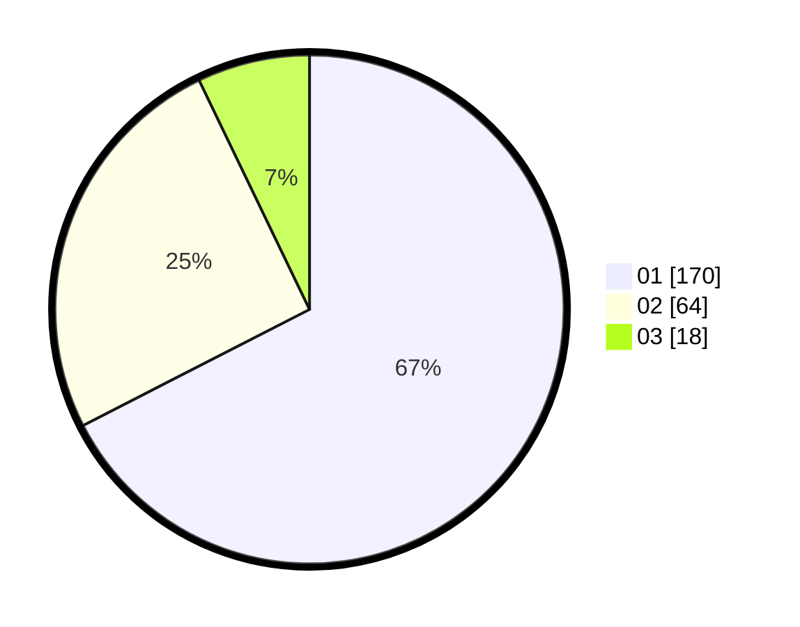

# Hasil

Hasil perolehan suara paslon dapat dilihat pada file paslon-01.txt, paslon-02.txt, dan paslon-03.txt.

Jika tidak ada, artinya data tersebut belum ada pada SIREKAP.

## Perolehan Suara

 * Paslon 01: **170**.
 * Paslon 02: **64**.
 * Paslon 03: **18**.

## Foto C Plano

https://sirekap-obj-formc.kpu.go.id/c91e/pemilu/ppwp/31/73/05/10/06/3173051006114-20240216-010741--5fa048c5-76b1-4d76-a9bb-cd3aba312228.jpg

https://sirekap-obj-formc.kpu.go.id/c91e/pemilu/ppwp/31/73/05/10/06/3173051006114-20240216-010754--ddd0768c-5b34-4fdf-8d4f-be75cb12c045.jpg

https://sirekap-obj-formc.kpu.go.id/c91e/pemilu/ppwp/31/73/05/10/06/3173051006114-20240216-010747--f195cfbe-87c6-41a7-a4e8-2ff51f41985a.jpg

## DATA PEMILIH TETAP

Jumlah pemilih dalam DPT: **276**.
 * L: **135**.
 * P: **141**.

## DATA PENGGUNA HAK PILIH

Jumlah pengguna hak pilih dalam DPT: **222**.
 * L: **104**.
 * P: **118**.

Jumlah pengguna hak pilih dalam DPTb: **27**.
 * L: **12**.
 * P: **15**.

Jumlah pengguna hak pilih dalam DPK: **6**.
 * L: **3**.
 * P: **3**.

Jumlah pengguna hak pilih: **255**.
 * L: **119**.
 * P: **136**.

## JUMLAH SUARA SAH DAN TIDAK SAH

JUMLAH SELURUH SUARA SAH: **252**.

JUMLAH SUARA TIDAK SAH: **3**.

JUMLAH SELURUH SUARA SAH DAN SUARA TIDAK SAH: **255**.
