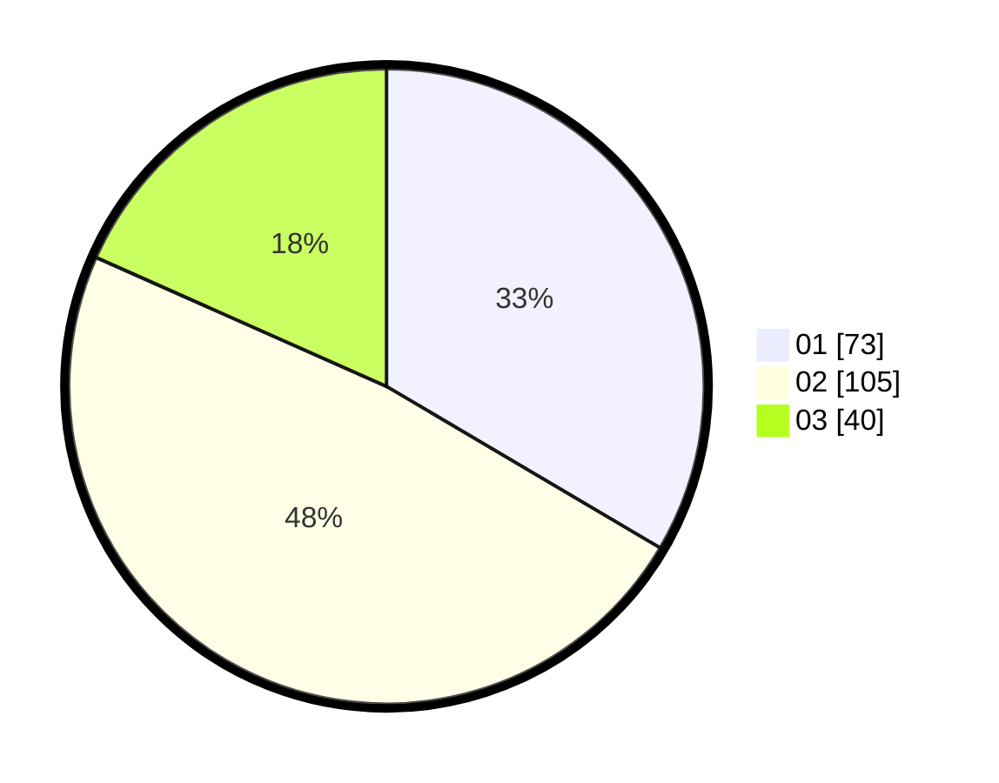

# Hasil

Hasil perolehan suara paslon dapat dilihat pada file paslon-01.txt, paslon-02.txt, dan paslon-03.txt.

Jika tidak ada, artinya data tersebut belum ada pada SIREKAP.

## Perolehan Suara

 * Paslon 01: **73**.
 * Paslon 02: **105**.
 * Paslon 03: **40**.

## Foto C Plano

https://sirekap-obj-formc.kpu.go.id/42fe/pemilu/ppwp/31/73/05/10/06/3173051006116-20240216-141320--33795976-758b-4ecc-8337-a68a1f9f7f5b.jpg

https://sirekap-obj-formc.kpu.go.id/42fe/pemilu/ppwp/31/73/05/10/06/3173051006116-20240216-141321--b519e7f8-6fcc-4246-8061-018d34a9a56c.jpg

https://sirekap-obj-formc.kpu.go.id/42fe/pemilu/ppwp/31/73/05/10/06/3173051006116-20240216-141321--1eeaee28-c71e-4a05-87a8-386490c69972.jpg

## DATA PEMILIH TETAP

Jumlah pemilih dalam DPT: **271**.
 * L: **133**.
 * P: **138**.

## DATA PENGGUNA HAK PILIH

Jumlah pengguna hak pilih dalam DPT: **219**.
 * L: **111**.
 * P: **108**.

Jumlah pengguna hak pilih dalam DPTb: **3**.
 * L: **1**.
 * P: **2**.

Jumlah pengguna hak pilih dalam DPK: **0**.
 * L: **0**.
 * P: **0**.

Jumlah pengguna hak pilih: **222**.
 * L: **112**.
 * P: **110**.

## JUMLAH SUARA SAH DAN TIDAK SAH

JUMLAH SELURUH SUARA SAH: **218**.

JUMLAH SUARA TIDAK SAH: **4**.

JUMLAH SELURUH SUARA SAH DAN SUARA TIDAK SAH: **222**.
