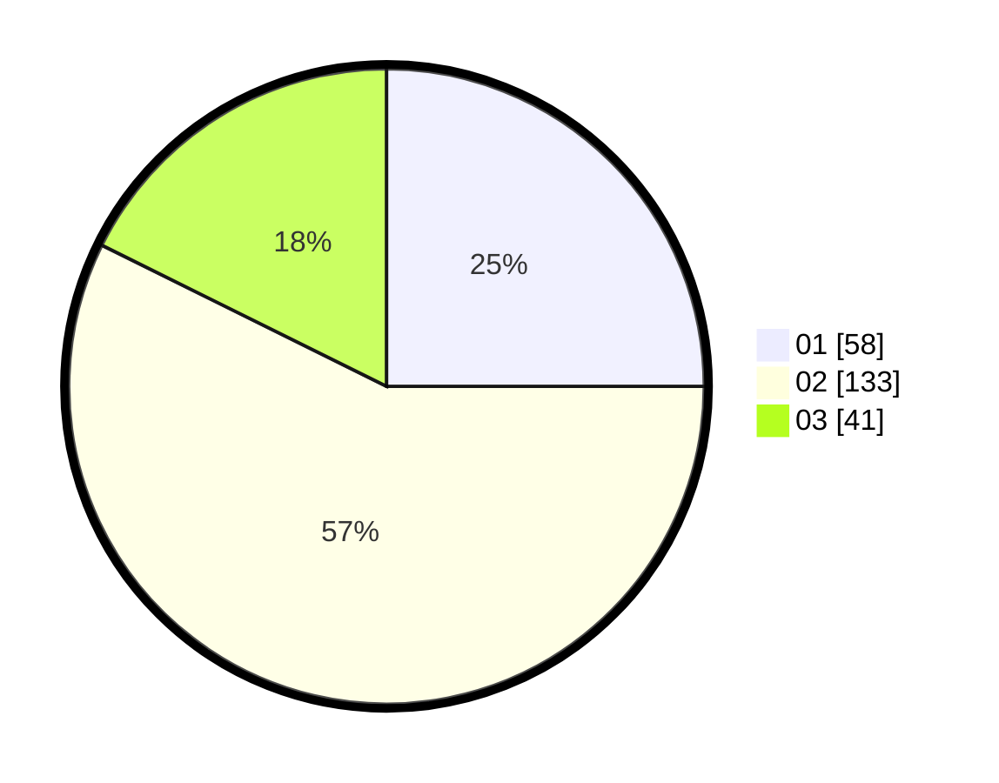

# Hasil

Hasil perolehan suara paslon dapat dilihat pada file paslon-01.txt, paslon-02.txt, dan paslon-03.txt.

Jika tidak ada, artinya data tersebut belum ada pada SIREKAP.

## Perolehan Suara

 * Paslon 01: **58**.
 * Paslon 02: **133**.
 * Paslon 03: **41**.

## Foto C Plano

https://sirekap-obj-formc.kpu.go.id/ecc2/pemilu/ppwp/31/73/05/10/06/3173051006118-20240215-011114--a6124dbe-e1c8-4b30-87c3-3f6b7ce1d05c.jpg

https://sirekap-obj-formc.kpu.go.id/ecc2/pemilu/ppwp/31/73/05/10/06/3173051006118-20240215-011243--dcde6a93-6e70-437c-b704-47ae5d79fea2.jpg

https://sirekap-obj-formc.kpu.go.id/ecc2/pemilu/ppwp/31/73/05/10/06/3173051006118-20240215-011356--5ff47855-14b4-403d-990a-3b8f8079a698.jpg

## DATA PEMILIH TETAP

Jumlah pemilih dalam DPT: **296**.
 * L: **148**.
 * P: **148**.

## DATA PENGGUNA HAK PILIH

Jumlah pengguna hak pilih dalam DPT: **226**.
 * L: **110**.
 * P: **116**.

Jumlah pengguna hak pilih dalam DPTb: **1**.
 * L: **1**.
 * P: **0**.

Jumlah pengguna hak pilih dalam DPK: **10**.
 * L: **4**.
 * P: **6**.

Jumlah pengguna hak pilih: **237**.
 * L: **115**.
 * P: **122**.

## JUMLAH SUARA SAH DAN TIDAK SAH

JUMLAH SELURUH SUARA SAH: **232**.

JUMLAH SUARA TIDAK SAH: **5**.

JUMLAH SELURUH SUARA SAH DAN SUARA TIDAK SAH: **237**.
