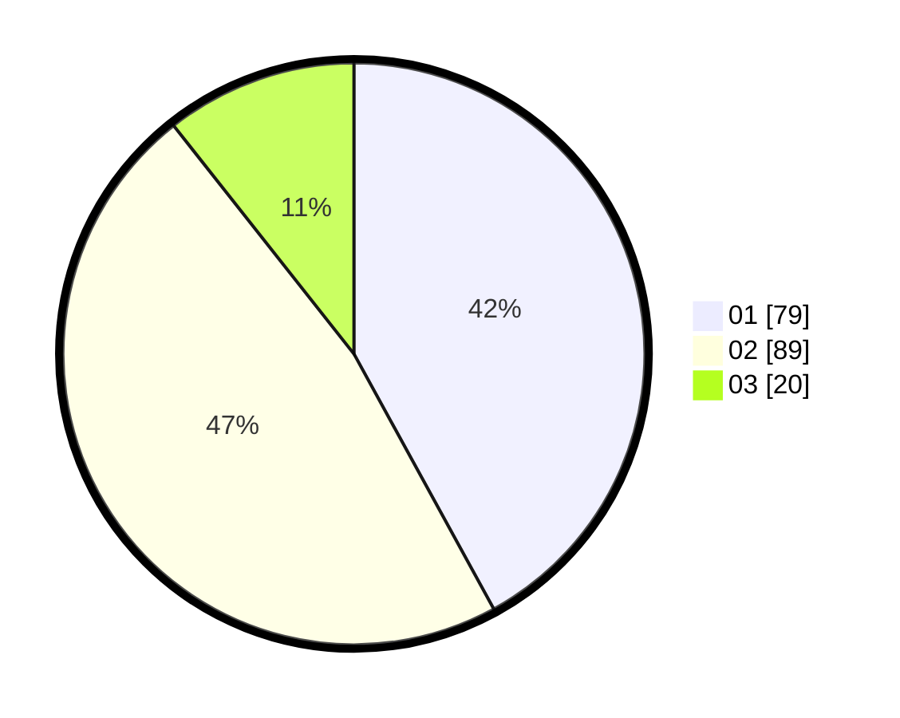

# Hasil

Hasil perolehan suara paslon dapat dilihat pada file paslon-01.txt, paslon-02.txt, dan paslon-03.txt.

Jika tidak ada, artinya data tersebut belum ada pada SIREKAP.

## Perolehan Suara

 * Paslon 01: **79**.
 * Paslon 02: **89**.
 * Paslon 03: **20**.

## Foto C Plano

https://sirekap-obj-formc.kpu.go.id/b1e7/pemilu/ppwp/31/73/05/10/06/3173051006121-20240216-212045--7cfafabc-5dd7-491c-8411-a624b65fc921.jpg

https://sirekap-obj-formc.kpu.go.id/b1e7/pemilu/ppwp/31/73/05/10/06/3173051006121-20240216-212131--304d3320-7d28-4237-b042-05999284bfa3.jpg

https://sirekap-obj-formc.kpu.go.id/b1e7/pemilu/ppwp/31/73/05/10/06/3173051006121-20240216-212209--9b55e631-ddfc-4fb5-b375-b8e3cd95cfc9.jpg

## DATA PEMILIH TETAP

Jumlah pemilih dalam DPT: **235**.
 * L: **124**.
 * P: **111**.

## DATA PENGGUNA HAK PILIH

Jumlah pengguna hak pilih dalam DPT: **190**.
 * L: **98**.
 * P: **92**.

Jumlah pengguna hak pilih dalam DPTb: **0**.
 * L: **0**.
 * P: **0**.

Jumlah pengguna hak pilih dalam DPK: **2**.
 * L: **2**.
 * P: **0**.

Jumlah pengguna hak pilih: **192**.
 * L: **100**.
 * P: **92**.

## JUMLAH SUARA SAH DAN TIDAK SAH

JUMLAH SELURUH SUARA SAH: **188**.

JUMLAH SUARA TIDAK SAH: **4**.

JUMLAH SELURUH SUARA SAH DAN SUARA TIDAK SAH: **192**.
