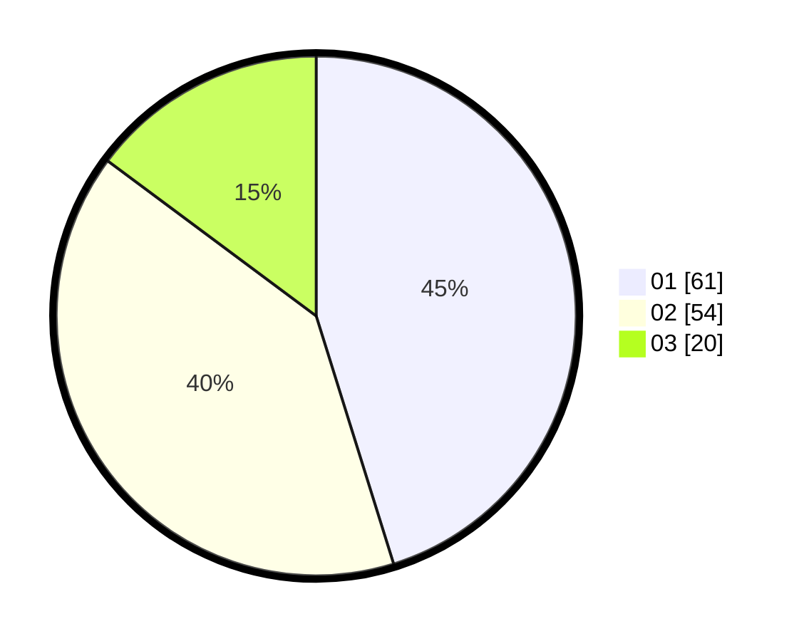

# Hasil

Hasil perolehan suara paslon dapat dilihat pada file paslon-01.txt, paslon-02.txt, dan paslon-03.txt.

Jika tidak ada, artinya data tersebut belum ada pada SIREKAP.

## Perolehan Suara

 * Paslon 01: **61**.
 * Paslon 02: **54**.
 * Paslon 03: **20**.

## Foto C Plano

https://sirekap-obj-formc.kpu.go.id/d8ec/pemilu/ppwp/31/73/05/10/06/3173051006122-20240216-130259--821d8076-e84d-4abe-8471-b4054789b495.jpg

https://sirekap-obj-formc.kpu.go.id/d8ec/pemilu/ppwp/31/73/05/10/06/3173051006122-20240216-130438--a282636d-45fc-48c9-90cc-7dd8c357d70d.jpg
