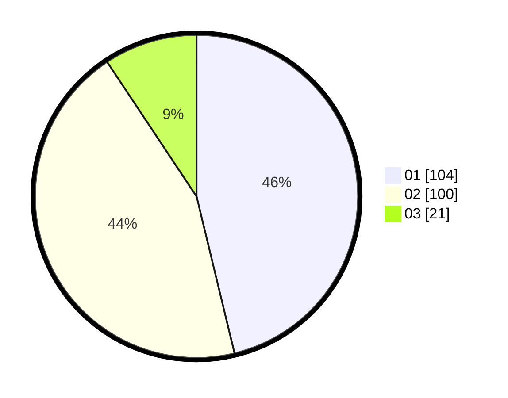

# Hasil

Hasil perolehan suara paslon dapat dilihat pada file paslon-01.txt, paslon-02.txt, dan paslon-03.txt.

Jika tidak ada, artinya data tersebut belum ada pada SIREKAP.

## Perolehan Suara

 * Paslon 01: **104**.
 * Paslon 02: **100**.
 * Paslon 03: **21**.

## Foto C Plano

https://sirekap-obj-formc.kpu.go.id/6e91/pemilu/ppwp/31/73/05/10/06/3173051006126-20240216-181333--99464fbd-8216-451d-b8db-bb433d74493c.jpg

https://sirekap-obj-formc.kpu.go.id/6e91/pemilu/ppwp/31/73/05/10/06/3173051006126-20240215-141720--988d97de-1ecd-4c38-b727-7406b49f3ab6.jpg

https://sirekap-obj-formc.kpu.go.id/6e91/pemilu/ppwp/31/73/05/10/06/3173051006126-20240215-141813--bbdabb6c-ec8b-4d1f-a6f4-d0d3fd0f1a64.jpg
