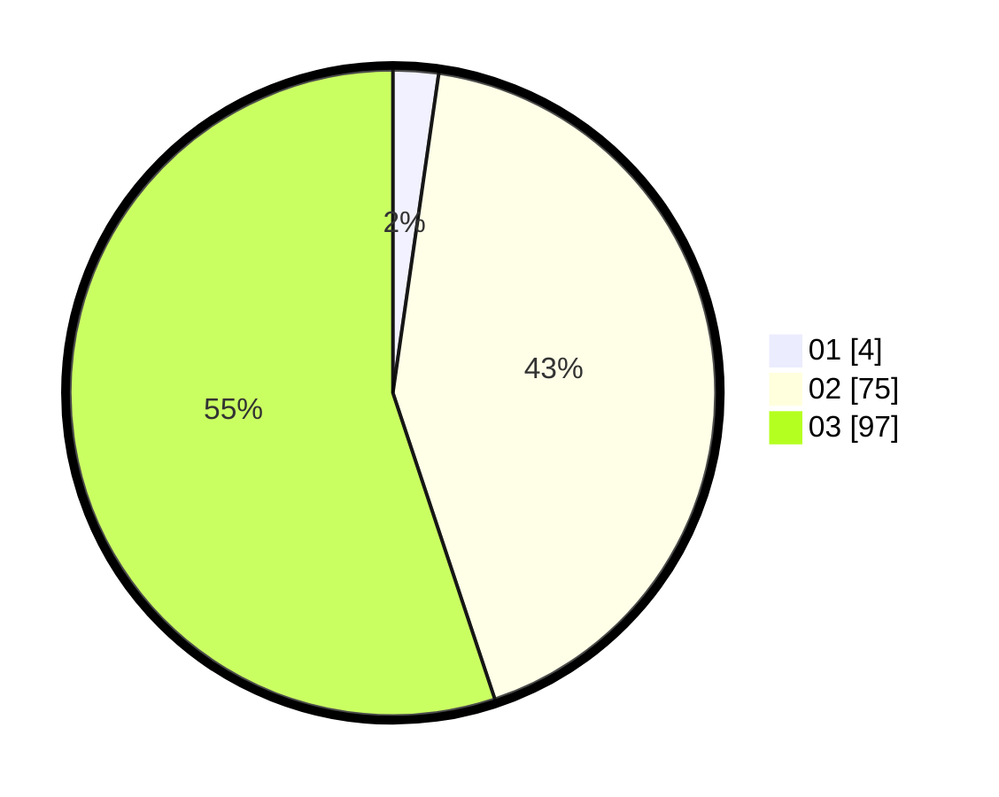

# Hasil

Hasil perolehan suara paslon dapat dilihat pada file paslon-01.txt, paslon-02.txt, dan paslon-03.txt.

Jika tidak ada, artinya data tersebut belum ada pada SIREKAP.

## Perolehan Suara

 * Paslon 01: **4**.
 * Paslon 02: **75**.
 * Paslon 03: **97**.

## Foto C Plano

https://sirekap-obj-formc.kpu.go.id/06d8/pemilu/ppwp/31/73/05/10/06/3173051006141-20240214-201939--7336acac-70ff-4e77-855c-6f7b77aa176d.jpg

https://sirekap-obj-formc.kpu.go.id/06d8/pemilu/ppwp/31/73/05/10/06/3173051006141-20240214-211317--ec3bc032-e7b7-4b77-9473-c178e9ec439f.jpg

https://sirekap-obj-formc.kpu.go.id/06d8/pemilu/ppwp/31/73/05/10/06/3173051006141-20240216-155120--164cd028-7c78-4143-9d5e-2ba9c634b8e5.jpg

## DATA PEMILIH TETAP

Jumlah pemilih dalam DPT: **264**.
 * L: **125**.
 * P: **139**.

## DATA PENGGUNA HAK PILIH

Jumlah pengguna hak pilih dalam DPT: **179**.
 * L: **85**.
 * P: **94**.

Jumlah pengguna hak pilih dalam DPTb: **9**.
 * L: **4**.
 * P: **5**.

Jumlah pengguna hak pilih dalam DPK: **9**.
 * L: **5**.
 * P: **4**.

Jumlah pengguna hak pilih: **197**.
 * L: **94**.
 * P: **103**.

## JUMLAH SUARA SAH DAN TIDAK SAH

JUMLAH SELURUH SUARA SAH: **177**.

JUMLAH SUARA TIDAK SAH: **20**.

JUMLAH SELURUH SUARA SAH DAN SUARA TIDAK SAH: **197**.
