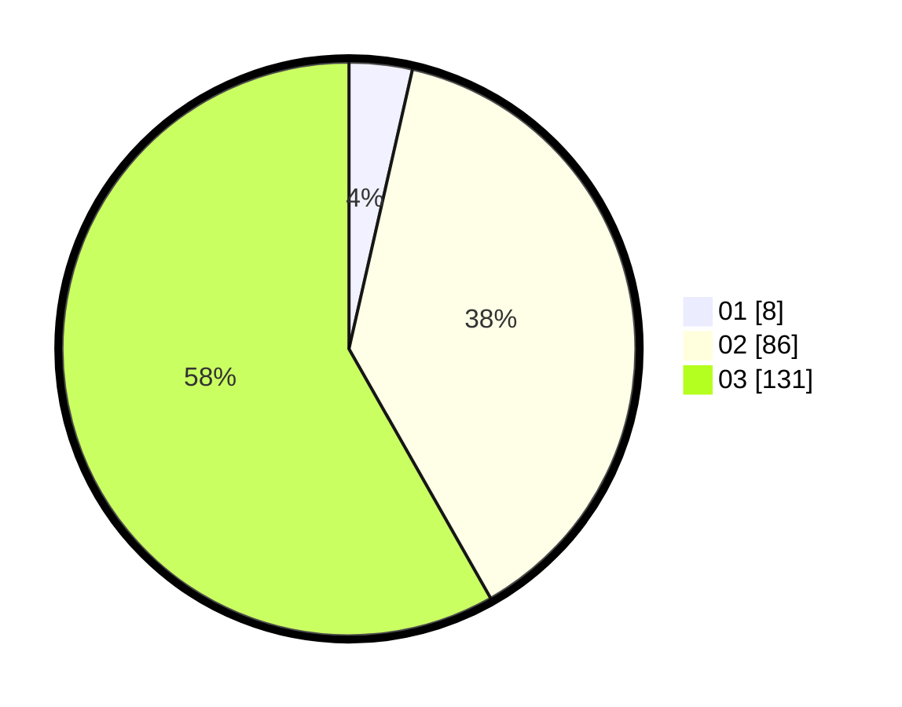

# Hasil

Hasil perolehan suara paslon dapat dilihat pada file paslon-01.txt, paslon-02.txt, dan paslon-03.txt.

Jika tidak ada, artinya data tersebut belum ada pada SIREKAP.

## Perolehan Suara

 * Paslon 01: **8**.
 * Paslon 02: **86**.
 * Paslon 03: **131**.

## Foto C Plano

https://sirekap-obj-formc.kpu.go.id/8c46/pemilu/ppwp/31/73/05/10/06/3173051006144-20240214-195050--d4c31445-233d-4a59-8848-4ec8d6f87aa0.jpg

https://sirekap-obj-formc.kpu.go.id/8c46/pemilu/ppwp/31/73/05/10/06/3173051006144-20240214-210928--bfb1b48e-412e-413d-9776-0227488be1c0.jpg

https://sirekap-obj-formc.kpu.go.id/8c46/pemilu/ppwp/31/73/05/10/06/3173051006144-20240214-211044--41151f7a-5933-45a5-9e88-d0b060b81574.jpg

## DATA PEMILIH TETAP

Jumlah pemilih dalam DPT: **281**.
 * L: **129**.
 * P: **152**.

## DATA PENGGUNA HAK PILIH

Jumlah pengguna hak pilih dalam DPT: **199**.
 * L: **91**.
 * P: **108**.

Jumlah pengguna hak pilih dalam DPTb: **20**.
 * L: **3**.
 * P: **17**.

Jumlah pengguna hak pilih dalam DPK: **6**.
 * L: **5**.
 * P: **1**.

Jumlah pengguna hak pilih: **225**.
 * L: **99**.
 * P: **126**.

## JUMLAH SUARA SAH DAN TIDAK SAH

JUMLAH SELURUH SUARA SAH: **225**.

JUMLAH SUARA TIDAK SAH: **0**.

JUMLAH SELURUH SUARA SAH DAN SUARA TIDAK SAH: **225**.
