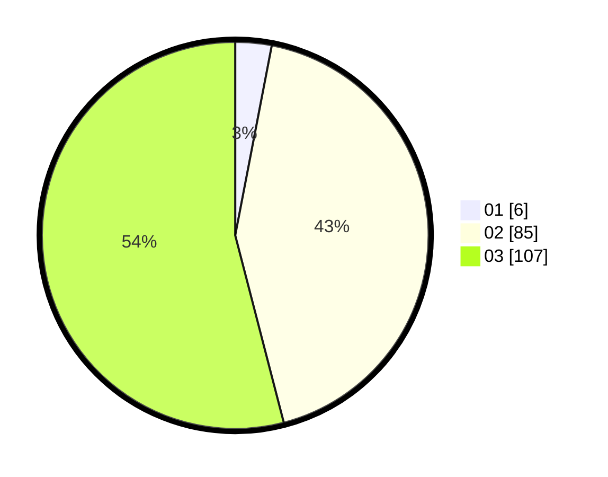

# Hasil

Hasil perolehan suara paslon dapat dilihat pada file paslon-01.txt, paslon-02.txt, dan paslon-03.txt.

Jika tidak ada, artinya data tersebut belum ada pada SIREKAP.

## Perolehan Suara

 * Paslon 01: **6**.
 * Paslon 02: **85**.
 * Paslon 03: **107**.

## Foto C Plano

https://sirekap-obj-formc.kpu.go.id/00e4/pemilu/ppwp/31/73/05/10/06/3173051006147-20240214-205325--5faf1154-bb2a-4bab-b427-68b4497761b9.jpg

https://sirekap-obj-formc.kpu.go.id/00e4/pemilu/ppwp/31/73/05/10/06/3173051006147-20240214-200722--cd480b41-63ea-4838-a069-6ea3772ec649.jpg

https://sirekap-obj-formc.kpu.go.id/00e4/pemilu/ppwp/31/73/05/10/06/3173051006147-20240214-200813--fb9a7767-f402-4b29-8ba9-d08b86c7678f.jpg

## DATA PEMILIH TETAP

Jumlah pemilih dalam DPT: **282**.
 * L: **136**.
 * P: **146**.

## DATA PENGGUNA HAK PILIH

Jumlah pengguna hak pilih dalam DPT: **184**.
 * L: **88**.
 * P: **96**.

Jumlah pengguna hak pilih dalam DPTb: **10**.
 * L: **6**.
 * P: **4**.

Jumlah pengguna hak pilih dalam DPK: **3**.
 * L: **2**.
 * P: **1**.

Jumlah pengguna hak pilih: **197**.
 * L: **96**.
 * P: **101**.

## JUMLAH SUARA SAH DAN TIDAK SAH

JUMLAH SELURUH SUARA SAH: **198**.

JUMLAH SUARA TIDAK SAH: **0**.

JUMLAH SELURUH SUARA SAH DAN SUARA TIDAK SAH: **198**.
