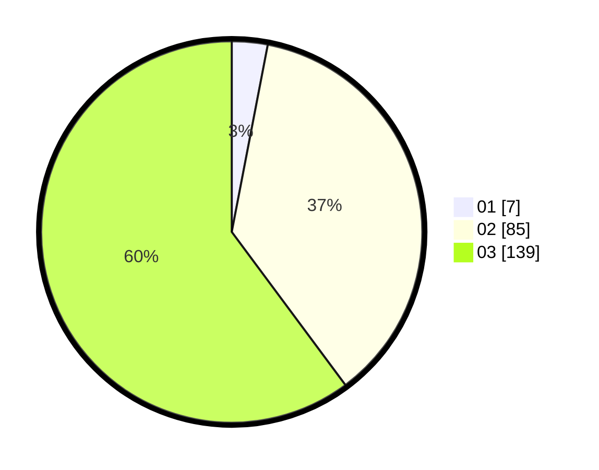

# Hasil

Hasil perolehan suara paslon dapat dilihat pada file paslon-01.txt, paslon-02.txt, dan paslon-03.txt.

Jika tidak ada, artinya data tersebut belum ada pada SIREKAP.

## Perolehan Suara

 * Paslon 01: **7**.
 * Paslon 02: **85**.
 * Paslon 03: **139**.

## Foto C Plano

https://sirekap-obj-formc.kpu.go.id/0f05/pemilu/ppwp/31/73/05/10/06/3173051006153-20240214-155730--81ca8942-6219-4110-ba4b-ff9013f16406.jpg

https://sirekap-obj-formc.kpu.go.id/0f05/pemilu/ppwp/31/73/05/10/06/3173051006153-20240214-190540--40cd0dc8-7947-4bc3-8125-6e69617ac151.jpg

https://sirekap-obj-formc.kpu.go.id/0f05/pemilu/ppwp/31/73/05/10/06/3173051006153-20240214-155750--15bda424-aae4-4222-afbd-f1a14a3b0946.jpg

## DATA PEMILIH TETAP

Jumlah pemilih dalam DPT: **276**.
 * L: **127**.
 * P: **149**.

## DATA PENGGUNA HAK PILIH

Jumlah pengguna hak pilih dalam DPT: **209**.
 * L: **95**.
 * P: **114**.

Jumlah pengguna hak pilih dalam DPTb: **7**.
 * L: **3**.
 * P: **4**.

Jumlah pengguna hak pilih dalam DPK: **18**.
 * L: **10**.
 * P: **8**.

Jumlah pengguna hak pilih: **234**.
 * L: **108**.
 * P: **126**.

## JUMLAH SUARA SAH DAN TIDAK SAH

JUMLAH SELURUH SUARA SAH: **231**.

JUMLAH SUARA TIDAK SAH: **3**.

JUMLAH SELURUH SUARA SAH DAN SUARA TIDAK SAH: **234**.
