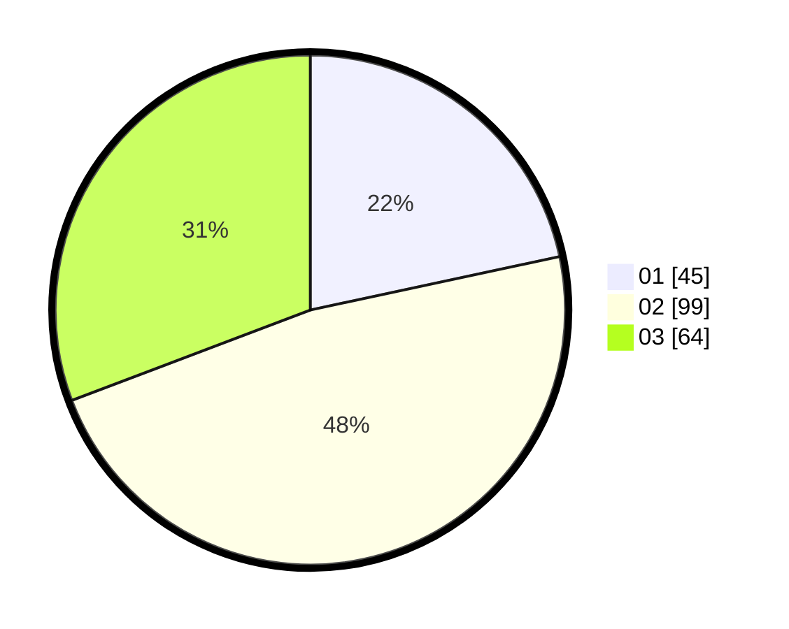

# Hasil

Hasil perolehan suara paslon dapat dilihat pada file paslon-01.txt, paslon-02.txt, dan paslon-03.txt.

Jika tidak ada, artinya data tersebut belum ada pada SIREKAP.

## Perolehan Suara

 * Paslon 01: **45**.
 * Paslon 02: **99**.
 * Paslon 03: **64**.

## Foto C Plano

https://sirekap-obj-formc.kpu.go.id/fe82/pemilu/ppwp/31/73/05/10/06/3173051006155-20240214-155403--e9cd6633-45f2-4a57-b36e-2ec71e1cf8d9.jpg

https://sirekap-obj-formc.kpu.go.id/fe82/pemilu/ppwp/31/73/05/10/06/3173051006155-20240214-155500--2f021d4b-a185-4ace-bcfb-4470486cdfbe.jpg

https://sirekap-obj-formc.kpu.go.id/fe82/pemilu/ppwp/31/73/05/10/06/3173051006155-20240214-155558--573ad428-ac4f-48b8-832f-627d57ee06b1.jpg
