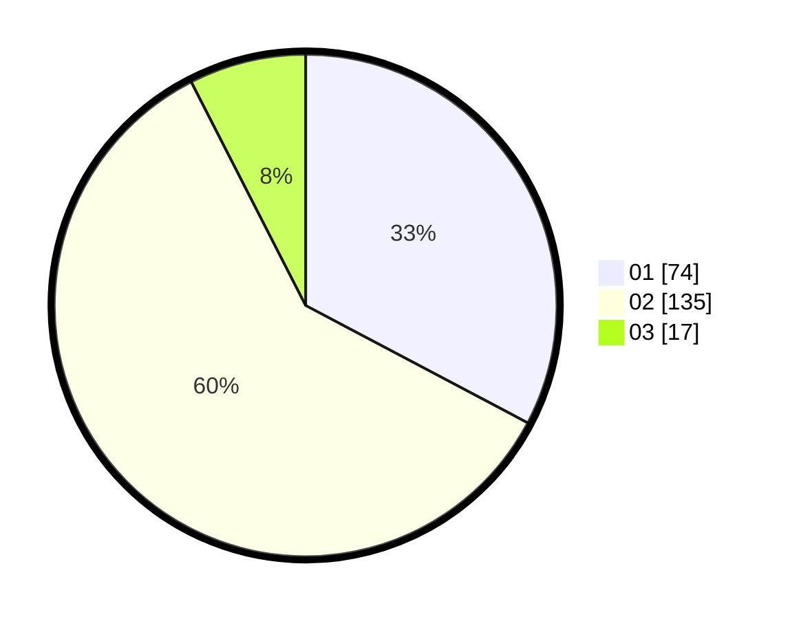

# Hasil

Hasil perolehan suara paslon dapat dilihat pada file paslon-01.txt, paslon-02.txt, dan paslon-03.txt.

Jika tidak ada, artinya data tersebut belum ada pada SIREKAP.

## Perolehan Suara

 * Paslon 01: **74**.
 * Paslon 02: **135**.
 * Paslon 03: **17**.

## Foto C Plano

https://sirekap-obj-formc.kpu.go.id/5cb5/pemilu/ppwp/31/73/05/10/06/3173051006901-20240214-210836--d6497cf6-039a-42e3-a4ab-133017f44cda.jpg

https://sirekap-obj-formc.kpu.go.id/5cb5/pemilu/ppwp/31/73/05/10/06/3173051006901-20240214-210912--4dc5fa26-8038-4f70-8d25-e4461de7347f.jpg

https://sirekap-obj-formc.kpu.go.id/5cb5/pemilu/ppwp/31/73/05/10/06/3173051006901-20240214-201101--40216bfd-f918-4a56-b26f-273d0ca7c778.jpg
