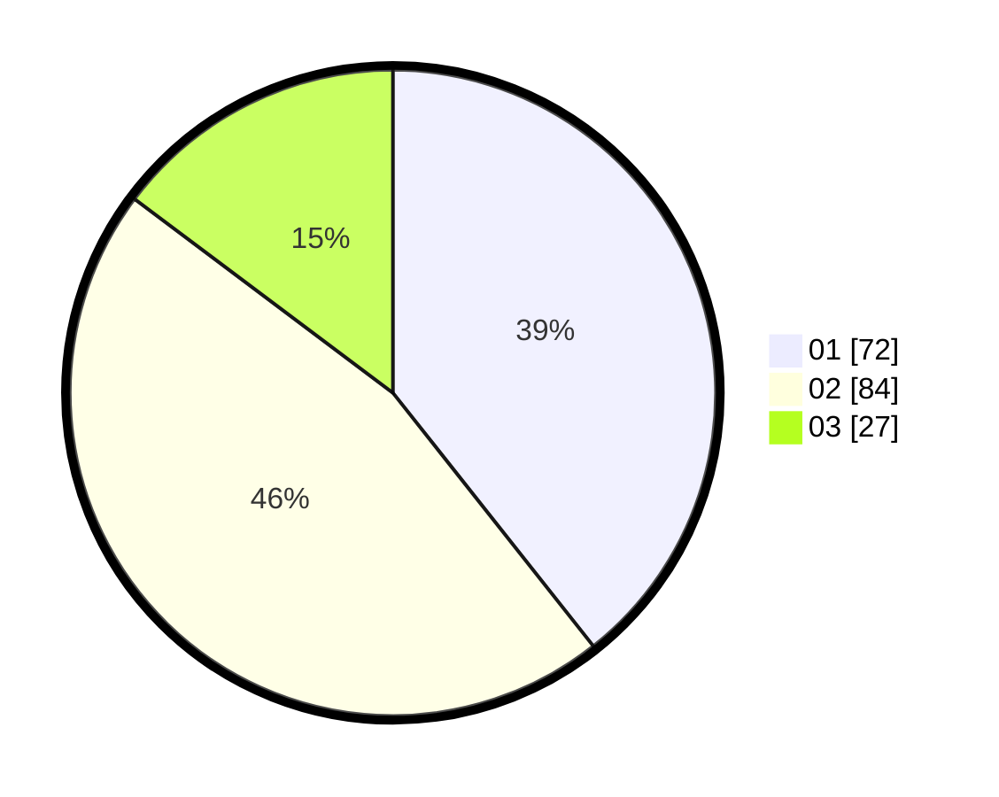

# Hasil

Hasil perolehan suara paslon dapat dilihat pada file paslon-01.txt, paslon-02.txt, dan paslon-03.txt.

Jika tidak ada, artinya data tersebut belum ada pada SIREKAP.

## Perolehan Suara

 * Paslon 01: **72**.
 * Paslon 02: **84**.
 * Paslon 03: **27**.

## Foto C Plano

https://sirekap-obj-formc.kpu.go.id/c628/pemilu/ppwp/31/73/05/10/07/3173051007003-20240214-233625--c369152d-9d8a-4e29-9a88-c98001a7eeb8.jpg

https://sirekap-obj-formc.kpu.go.id/c628/pemilu/ppwp/31/73/05/10/07/3173051007003-20240214-233209--27e97048-07de-45c0-9388-dad153ff3e57.jpg

https://sirekap-obj-formc.kpu.go.id/c628/pemilu/ppwp/31/73/05/10/07/3173051007003-20240214-233303--1dc0586d-49e8-442f-b8a1-472a436c1023.jpg
