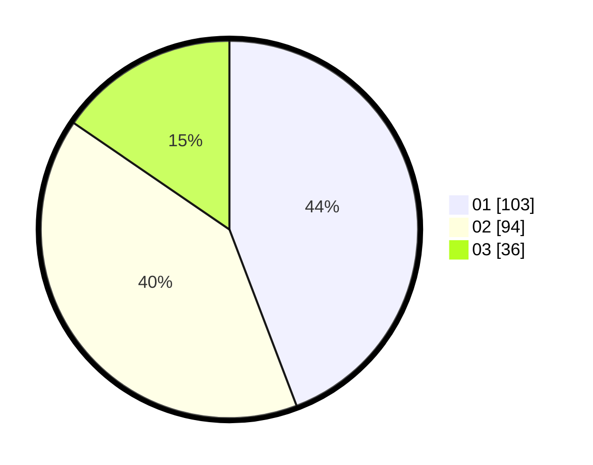

# Hasil

Hasil perolehan suara paslon dapat dilihat pada file paslon-01.txt, paslon-02.txt, dan paslon-03.txt.

Jika tidak ada, artinya data tersebut belum ada pada SIREKAP.

## Perolehan Suara

 * Paslon 01: **103**.
 * Paslon 02: **94**.
 * Paslon 03: **36**.

## Foto C Plano

https://sirekap-obj-formc.kpu.go.id/3448/pemilu/ppwp/31/73/05/10/07/3173051007008-20240216-141852--a320023c-3251-46d5-bcd4-09904da6b1de.jpg

https://sirekap-obj-formc.kpu.go.id/3448/pemilu/ppwp/31/73/05/10/07/3173051007008-20240216-141853--cd9418c0-960c-4f47-ae67-ee8415229c53.jpg

https://sirekap-obj-formc.kpu.go.id/3448/pemilu/ppwp/31/73/05/10/07/3173051007008-20240216-141852--2e245d16-3ccf-4a2d-bbde-33d28cd1222e.jpg

## DATA PEMILIH TETAP

Jumlah pemilih dalam DPT: **289**.
 * L: **140**.
 * P: **149**.

## DATA PENGGUNA HAK PILIH

Jumlah pengguna hak pilih dalam DPT: **233**.
 * L: **110**.
 * P: **123**.

Jumlah pengguna hak pilih dalam DPTb: **5**.
 * L: **3**.
 * P: **2**.

Jumlah pengguna hak pilih dalam DPK: **4**.
 * L: **2**.
 * P: **2**.

Jumlah pengguna hak pilih: **242**.
 * L: **115**.
 * P: **127**.

## JUMLAH SUARA SAH DAN TIDAK SAH

JUMLAH SELURUH SUARA SAH: **233**.

JUMLAH SUARA TIDAK SAH: **9**.

JUMLAH SELURUH SUARA SAH DAN SUARA TIDAK SAH: **242**.
