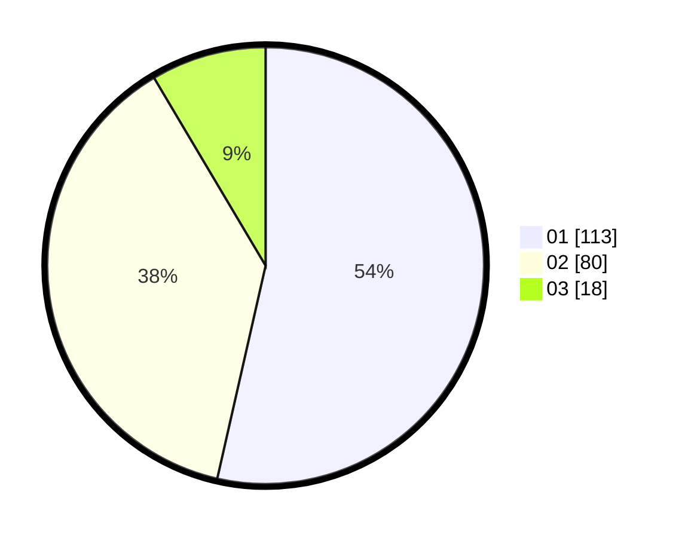

# Hasil

Hasil perolehan suara paslon dapat dilihat pada file paslon-01.txt, paslon-02.txt, dan paslon-03.txt.

Jika tidak ada, artinya data tersebut belum ada pada SIREKAP.

## Perolehan Suara

 * Paslon 01: **113**.
 * Paslon 02: **80**.
 * Paslon 03: **18**.

## Foto C Plano

https://sirekap-obj-formc.kpu.go.id/0ed0/pemilu/ppwp/31/73/05/10/07/3173051007010-20240215-004019--5e139e6e-8409-4448-89ea-072c9af534dc.jpg

https://sirekap-obj-formc.kpu.go.id/0ed0/pemilu/ppwp/31/73/05/10/07/3173051007010-20240215-004234--5cec5b12-5f6f-4d99-88bb-dc601aef2bdf.jpg

https://sirekap-obj-formc.kpu.go.id/0ed0/pemilu/ppwp/31/73/05/10/07/3173051007010-20240215-004410--c950c4a5-bdcc-40a3-9ba5-4328330f0dfb.jpg

## DATA PEMILIH TETAP

Jumlah pemilih dalam DPT: **281**.
 * L: **155**.
 * P: **126**.

## DATA PENGGUNA HAK PILIH

Jumlah pengguna hak pilih dalam DPT: **212**.
 * L: **110**.
 * P: **102**.

Jumlah pengguna hak pilih dalam DPTb: **1**.
 * L: **1**.
 * P: **0**.

Jumlah pengguna hak pilih dalam DPK: **2**.
 * L: **1**.
 * P: **1**.

Jumlah pengguna hak pilih: **215**.
 * L: **112**.
 * P: **103**.

## JUMLAH SUARA SAH DAN TIDAK SAH

JUMLAH SELURUH SUARA SAH: **211**.

JUMLAH SUARA TIDAK SAH: **4**.

JUMLAH SELURUH SUARA SAH DAN SUARA TIDAK SAH: **215**.
