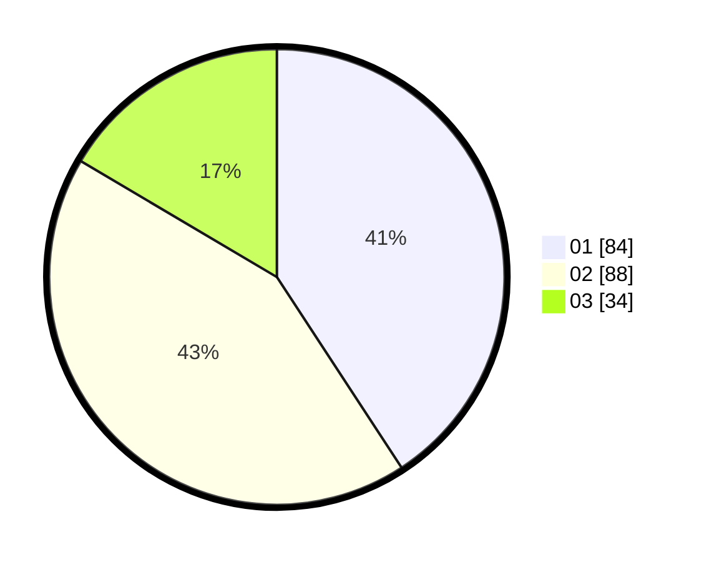

# Hasil

Hasil perolehan suara paslon dapat dilihat pada file paslon-01.txt, paslon-02.txt, dan paslon-03.txt.

Jika tidak ada, artinya data tersebut belum ada pada SIREKAP.

## Perolehan Suara

 * Paslon 01: **84**.
 * Paslon 02: **88**.
 * Paslon 03: **34**.

## Foto C Plano

https://sirekap-obj-formc.kpu.go.id/13fa/pemilu/ppwp/31/73/05/10/07/3173051007013-20240215-003738--7da85bf1-49c5-44af-b7d6-26353bcb6d9e.jpg

https://sirekap-obj-formc.kpu.go.id/13fa/pemilu/ppwp/31/73/05/10/07/3173051007013-20240215-003835--cbf21f27-87cf-432f-9b92-dd5b74e52a29.jpg

https://sirekap-obj-formc.kpu.go.id/13fa/pemilu/ppwp/31/73/05/10/07/3173051007013-20240215-003938--e7ebb30f-0367-451d-9bdd-7221296415c2.jpg
