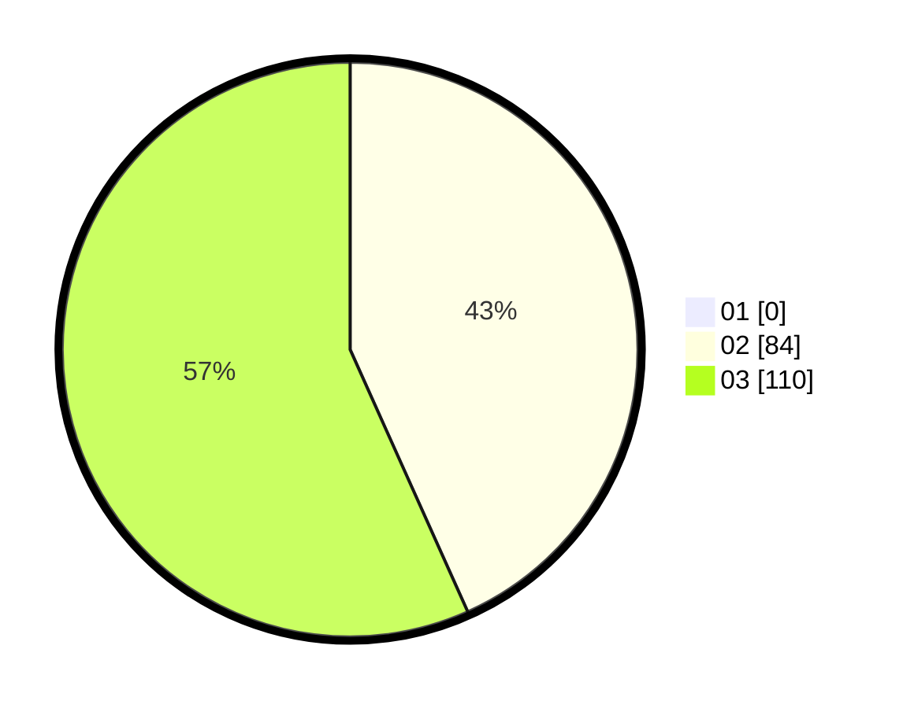

# Hasil

Hasil perolehan suara paslon dapat dilihat pada file paslon-01.txt, paslon-02.txt, dan paslon-03.txt.

Jika tidak ada, artinya data tersebut belum ada pada SIREKAP.

## Perolehan Suara

 * Paslon 01: **0**.
 * Paslon 02: **84**.
 * Paslon 03: **110**.

## Foto C Plano

https://sirekap-obj-formc.kpu.go.id/81b2/pemilu/ppwp/31/73/05/10/07/3173051007014-20240216-001324--cd31bb50-d162-411a-a75d-597e979e4fc3.jpg

https://sirekap-obj-formc.kpu.go.id/81b2/pemilu/ppwp/31/73/05/10/07/3173051007014-20240216-001327--fec12e24-29a3-4bd6-bb0b-71097795a824.jpg

https://sirekap-obj-formc.kpu.go.id/81b2/pemilu/ppwp/31/73/05/10/07/3173051007014-20240216-001325--9667411d-7ab7-4ec8-9359-b0918e623777.jpg

## DATA PEMILIH TETAP

Jumlah pemilih dalam DPT: **257**.
 * L: **131**.
 * P: **126**.

## DATA PENGGUNA HAK PILIH

Jumlah pengguna hak pilih dalam DPT: **192**.
 * L: **96**.
 * P: **96**.

Jumlah pengguna hak pilih dalam DPTb: **1**.
 * L: **0**.
 * P: **1**.

Jumlah pengguna hak pilih dalam DPK: **2**.
 * L: **1**.
 * P: **1**.

Jumlah pengguna hak pilih: **195**.
 * L: **97**.
 * P: **98**.

## JUMLAH SUARA SAH DAN TIDAK SAH

JUMLAH SELURUH SUARA SAH: **194**.

JUMLAH SUARA TIDAK SAH: **1**.

JUMLAH SELURUH SUARA SAH DAN SUARA TIDAK SAH: **195**.
