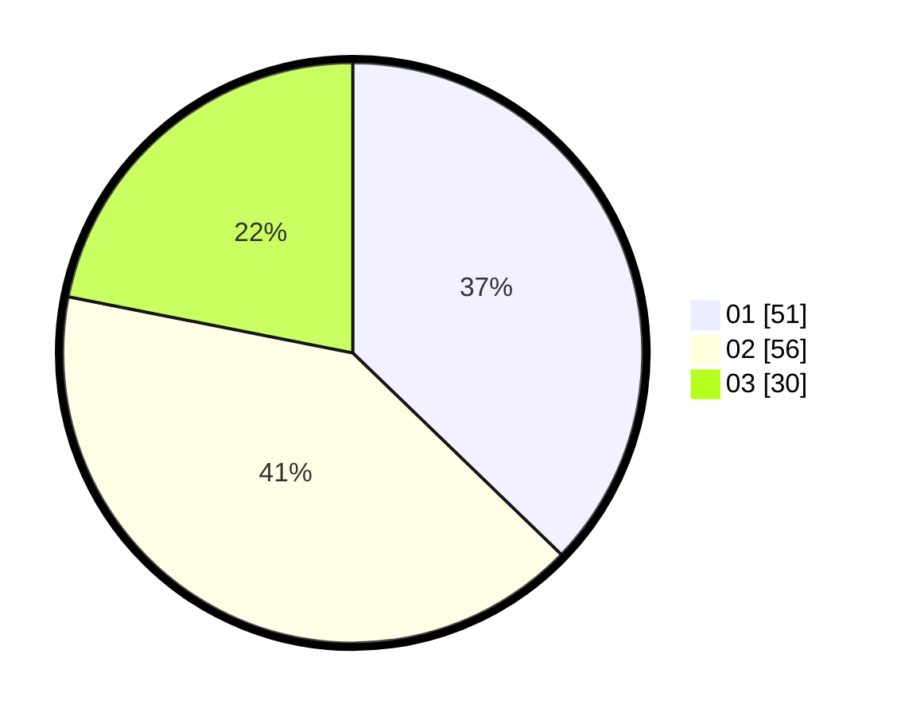

# Hasil

Hasil perolehan suara paslon dapat dilihat pada file paslon-01.txt, paslon-02.txt, dan paslon-03.txt.

Jika tidak ada, artinya data tersebut belum ada pada SIREKAP.

## Perolehan Suara

 * Paslon 01: **51**.
 * Paslon 02: **56**.
 * Paslon 03: **30**.

## Foto C Plano

https://sirekap-obj-formc.kpu.go.id/8d45/pemilu/ppwp/31/73/05/10/07/3173051007016-20240216-155208--bb990a18-9dd4-4d8e-ba29-89adb05bd84c.jpg

https://sirekap-obj-formc.kpu.go.id/8d45/pemilu/ppwp/31/73/05/10/07/3173051007016-20240215-100706--9ebab819-023e-477f-bdd9-510579a12216.jpg

https://sirekap-obj-formc.kpu.go.id/8d45/pemilu/ppwp/31/73/05/10/07/3173051007016-20240215-100717--6bdf8fdc-550c-4b1e-b52f-8880b4c2c73c.jpg
