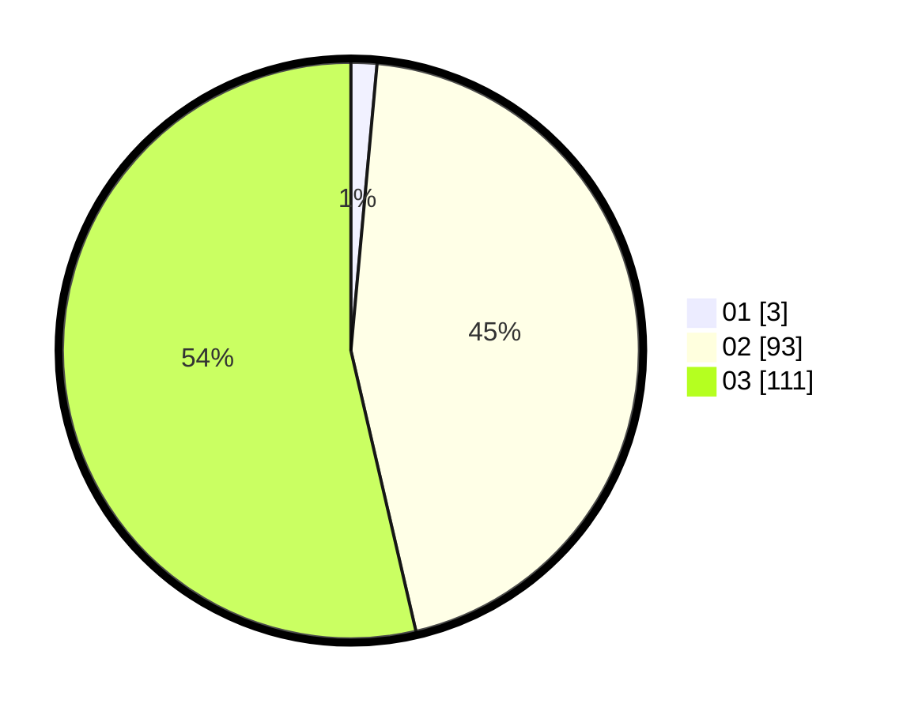

# Hasil

Hasil perolehan suara paslon dapat dilihat pada file paslon-01.txt, paslon-02.txt, dan paslon-03.txt.

Jika tidak ada, artinya data tersebut belum ada pada SIREKAP.

## Perolehan Suara

 * Paslon 01: **3**.
 * Paslon 02: **93**.
 * Paslon 03: **111**.

## Foto C Plano

https://sirekap-obj-formc.kpu.go.id/0199/pemilu/ppwp/31/73/05/10/07/3173051007024-20240214-215538--ca1efb6a-a69d-4848-8d22-bba61235a840.jpg

https://sirekap-obj-formc.kpu.go.id/0199/pemilu/ppwp/31/73/05/10/07/3173051007024-20240214-215611--3211a3f5-99e4-4d69-b1b0-d51dbbe952d1.jpg

https://sirekap-obj-formc.kpu.go.id/0199/pemilu/ppwp/31/73/05/10/07/3173051007024-20240214-215646--9998db32-dba8-4531-a8ca-d4e1591976b8.jpg
