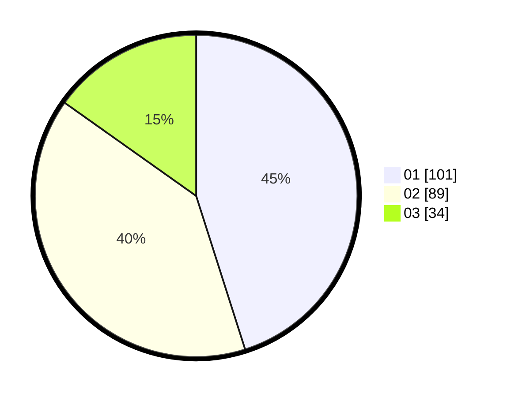

# Hasil

Hasil perolehan suara paslon dapat dilihat pada file paslon-01.txt, paslon-02.txt, dan paslon-03.txt.

Jika tidak ada, artinya data tersebut belum ada pada SIREKAP.

## Perolehan Suara

 * Paslon 01: **101**.
 * Paslon 02: **89**.
 * Paslon 03: **34**.

## Foto C Plano

https://sirekap-obj-formc.kpu.go.id/47b5/pemilu/ppwp/31/73/05/10/07/3173051007028-20240216-141531--c62f21fb-2feb-419d-ae04-ef1131489f83.jpg

https://sirekap-obj-formc.kpu.go.id/47b5/pemilu/ppwp/31/73/05/10/07/3173051007028-20240216-142812--f339f5dd-553e-4c03-84e5-b3bee95d7f33.jpg

https://sirekap-obj-formc.kpu.go.id/47b5/pemilu/ppwp/31/73/05/10/07/3173051007028-20240216-143206--6c88d347-b76e-442d-bce7-a64046a1772f.jpg

## DATA PEMILIH TETAP

Jumlah pemilih dalam DPT: **280**.
 * L: **134**.
 * P: **146**.

## DATA PENGGUNA HAK PILIH

Jumlah pengguna hak pilih dalam DPT: **224**.
 * L: **99**.
 * P: **125**.

Jumlah pengguna hak pilih dalam DPTb: **0**.
 * L: **0**.
 * P: **0**.

Jumlah pengguna hak pilih dalam DPK: **2**.
 * L: **1**.
 * P: **1**.

Jumlah pengguna hak pilih: **226**.
 * L: **100**.
 * P: **126**.

## JUMLAH SUARA SAH DAN TIDAK SAH

JUMLAH SELURUH SUARA SAH: **224**.

JUMLAH SUARA TIDAK SAH: **2**.

JUMLAH SELURUH SUARA SAH DAN SUARA TIDAK SAH: **226**.
