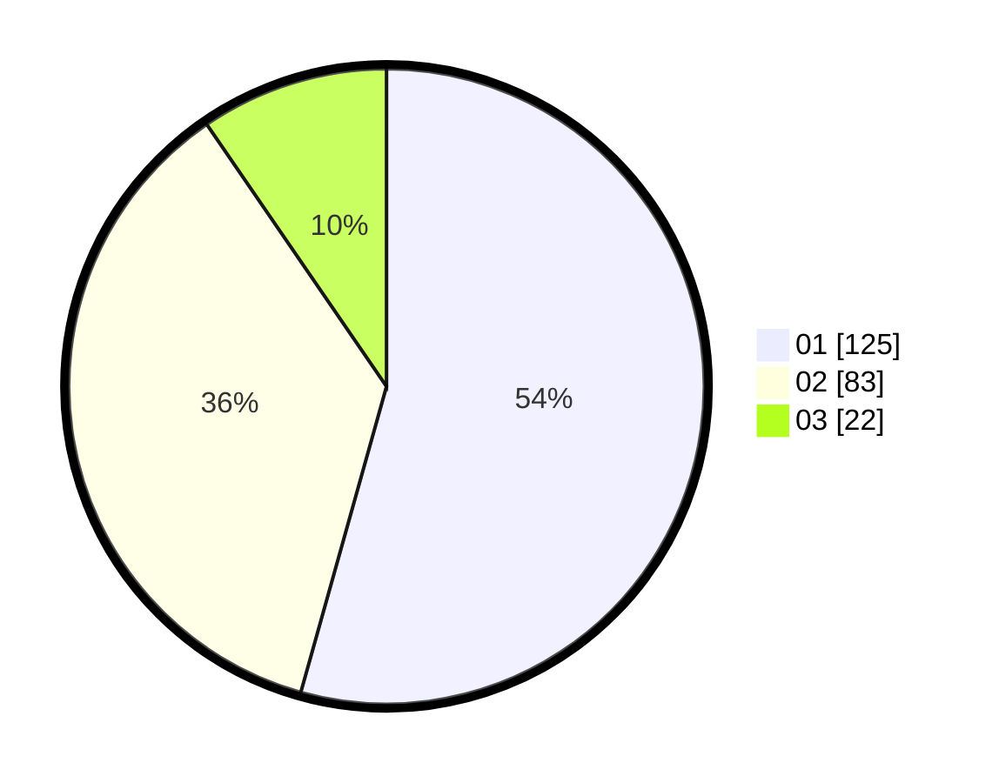

# Hasil

Hasil perolehan suara paslon dapat dilihat pada file paslon-01.txt, paslon-02.txt, dan paslon-03.txt.

Jika tidak ada, artinya data tersebut belum ada pada SIREKAP.

## Perolehan Suara

 * Paslon 01: **125**.
 * Paslon 02: **83**.
 * Paslon 03: **22**.

## Foto C Plano

https://sirekap-obj-formc.kpu.go.id/1a08/pemilu/ppwp/31/73/05/10/07/3173051007039-20240215-013934--1e06bf5b-12b9-488d-b4a1-6ea3cf1acac3.jpg

https://sirekap-obj-formc.kpu.go.id/1a08/pemilu/ppwp/31/73/05/10/07/3173051007039-20240215-014030--84b3a71e-fc52-4781-ad04-95f1478486ac.jpg

https://sirekap-obj-formc.kpu.go.id/1a08/pemilu/ppwp/31/73/05/10/07/3173051007039-20240215-014134--a400a74d-66b2-4d1e-91f5-c0279f27f565.jpg
