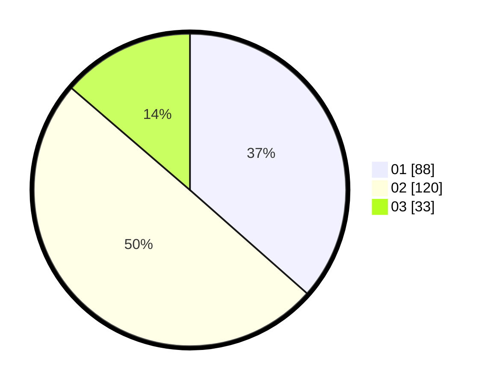

# Hasil

Hasil perolehan suara paslon dapat dilihat pada file paslon-01.txt, paslon-02.txt, dan paslon-03.txt.

Jika tidak ada, artinya data tersebut belum ada pada SIREKAP.

## Perolehan Suara

 * Paslon 01: **88**.
 * Paslon 02: **120**.
 * Paslon 03: **33**.

## Foto C Plano

https://sirekap-obj-formc.kpu.go.id/6bf9/pemilu/ppwp/31/73/05/10/07/3173051007041-20240216-122343--87726925-8871-43e5-b09e-23dd35d82d3a.jpg

https://sirekap-obj-formc.kpu.go.id/6bf9/pemilu/ppwp/31/73/05/10/07/3173051007041-20240216-122345--2b8b2441-7055-4fc8-b52b-1b9b81319eda.jpg

https://sirekap-obj-formc.kpu.go.id/6bf9/pemilu/ppwp/31/73/05/10/07/3173051007041-20240216-122344--25c02ec1-c0af-49f3-8a95-07f01e3226b9.jpg

## DATA PEMILIH TETAP

Jumlah pemilih dalam DPT: **284**.
 * L: **147**.
 * P: **137**.

## DATA PENGGUNA HAK PILIH

Jumlah pengguna hak pilih dalam DPT: **235**.
 * L: **120**.
 * P: **115**.

Jumlah pengguna hak pilih dalam DPTb: **7**.
 * L: **3**.
 * P: **4**.

Jumlah pengguna hak pilih dalam DPK: **0**.
 * L: **2**.
 * P: **0**.

Jumlah pengguna hak pilih: **244**.
 * L: **125**.
 * P: **119**.

## JUMLAH SUARA SAH DAN TIDAK SAH

JUMLAH SELURUH SUARA SAH: **241**.

JUMLAH SUARA TIDAK SAH: **3**.

JUMLAH SELURUH SUARA SAH DAN SUARA TIDAK SAH: **244**.
