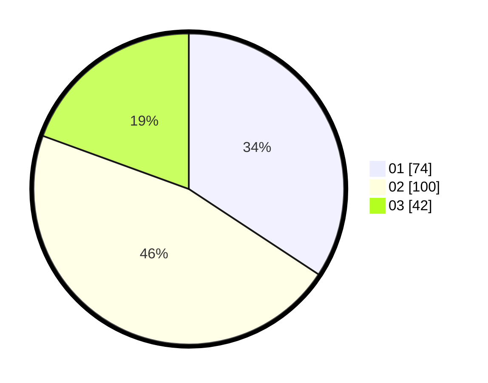

# Hasil

Hasil perolehan suara paslon dapat dilihat pada file paslon-01.txt, paslon-02.txt, dan paslon-03.txt.

Jika tidak ada, artinya data tersebut belum ada pada SIREKAP.

## Perolehan Suara

 * Paslon 01: **74**.
 * Paslon 02: **100**.
 * Paslon 03: **42**.

## Foto C Plano

https://sirekap-obj-formc.kpu.go.id/5353/pemilu/ppwp/31/73/05/10/07/3173051007043-20240215-003330--db84012e-a34b-4819-a71b-2dc29463cdf0.jpg

https://sirekap-obj-formc.kpu.go.id/5353/pemilu/ppwp/31/73/05/10/07/3173051007043-20240215-003450--1509e4c1-4313-4969-8eac-9dd8273ba715.jpg

https://sirekap-obj-formc.kpu.go.id/5353/pemilu/ppwp/31/73/05/10/07/3173051007043-20240215-000651--f5c6031f-158f-4362-aaf7-6c72d5f2c089.jpg

## DATA PEMILIH TETAP

Jumlah pemilih dalam DPT: **278**.
 * L: **136**.
 * P: **142**.

## DATA PENGGUNA HAK PILIH

Jumlah pengguna hak pilih dalam DPT: **212**.
 * L: **102**.
 * P: **110**.

Jumlah pengguna hak pilih dalam DPTb: **10**.
 * L: **6**.
 * P: **4**.

Jumlah pengguna hak pilih dalam DPK: **5**.
 * L: **3**.
 * P: **2**.

Jumlah pengguna hak pilih: **227**.
 * L: **111**.
 * P: **116**.

## JUMLAH SUARA SAH DAN TIDAK SAH

JUMLAH SELURUH SUARA SAH: **216**.

JUMLAH SUARA TIDAK SAH: **10**.

JUMLAH SELURUH SUARA SAH DAN SUARA TIDAK SAH: **226**.
