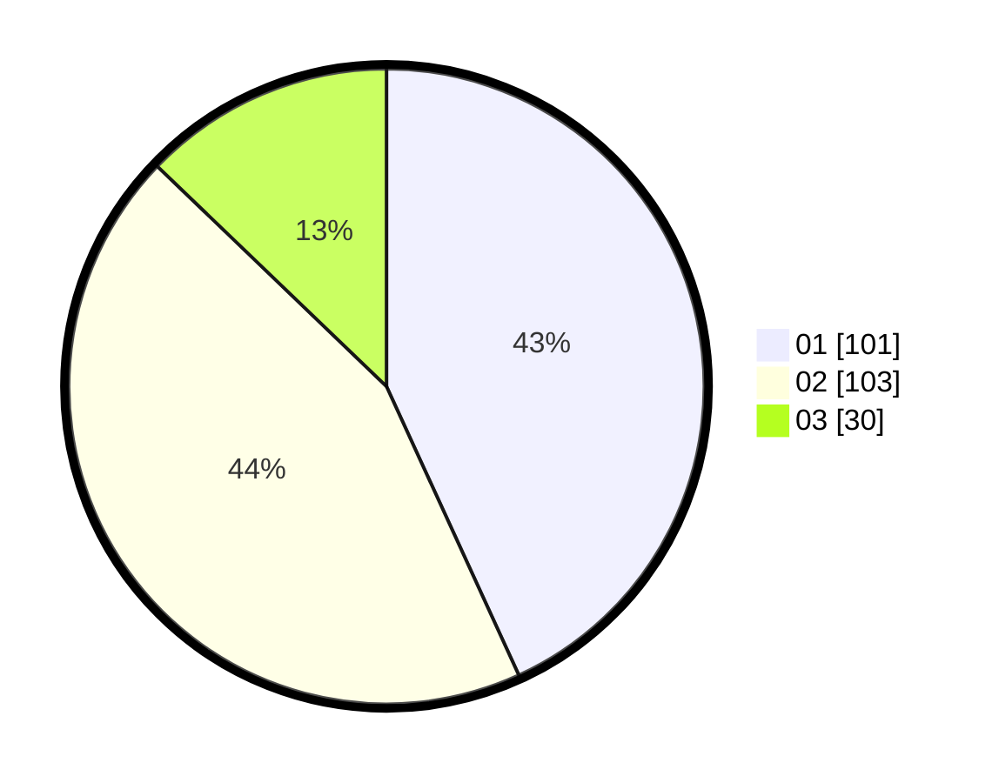

# Hasil

Hasil perolehan suara paslon dapat dilihat pada file paslon-01.txt, paslon-02.txt, dan paslon-03.txt.

Jika tidak ada, artinya data tersebut belum ada pada SIREKAP.

## Perolehan Suara

 * Paslon 01: **101**.
 * Paslon 02: **103**.
 * Paslon 03: **30**.

## Foto C Plano

https://sirekap-obj-formc.kpu.go.id/1e46/pemilu/ppwp/31/73/05/10/07/3173051007044-20240215-025345--a71097a4-d204-45d0-8def-901503170d60.jpg

https://sirekap-obj-formc.kpu.go.id/1e46/pemilu/ppwp/31/73/05/10/07/3173051007044-20240215-010549--feae6b3f-c808-4e40-bccb-d01560392d74.jpg

https://sirekap-obj-formc.kpu.go.id/1e46/pemilu/ppwp/31/73/05/10/07/3173051007044-20240215-010646--38f5cab0-7122-453a-9cae-ad316357bc6c.jpg
