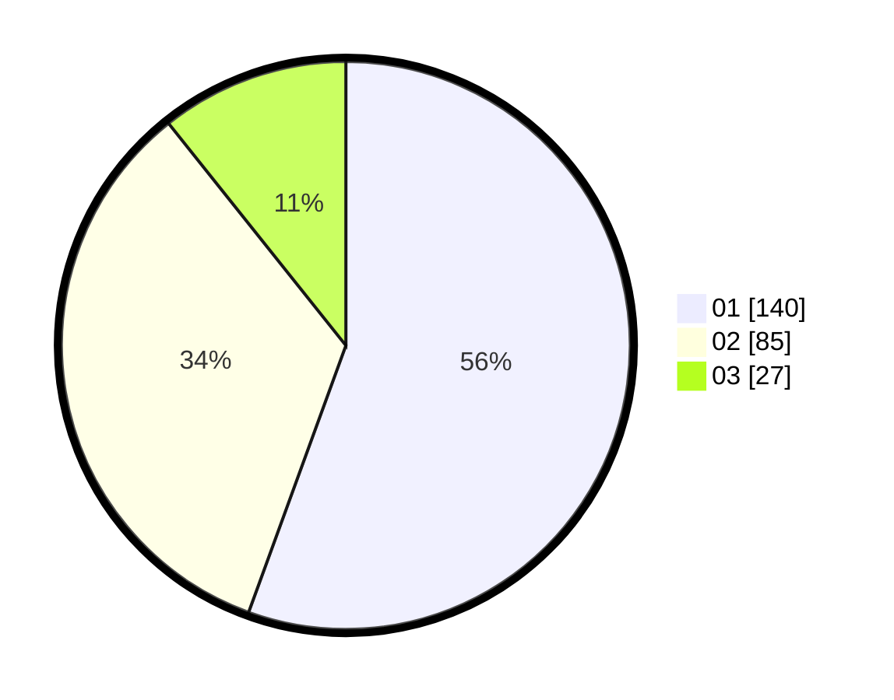

# Hasil

Hasil perolehan suara paslon dapat dilihat pada file paslon-01.txt, paslon-02.txt, dan paslon-03.txt.

Jika tidak ada, artinya data tersebut belum ada pada SIREKAP.

## Perolehan Suara

 * Paslon 01: **140**.
 * Paslon 02: **85**.
 * Paslon 03: **27**.

## Foto C Plano

https://sirekap-obj-formc.kpu.go.id/96ac/pemilu/ppwp/31/73/05/10/07/3173051007046-20240217-091342--d8dad810-60f7-4efb-bfcf-8388b5d764a4.jpg

https://sirekap-obj-formc.kpu.go.id/96ac/pemilu/ppwp/31/73/05/10/07/3173051007046-20240215-001753--bd920f7f-4bfb-486b-8678-75c6b8d4ac74.jpg

https://sirekap-obj-formc.kpu.go.id/96ac/pemilu/ppwp/31/73/05/10/07/3173051007046-20240215-001839--26688fc8-645e-428d-88b9-7fd2e33a89cd.jpg
