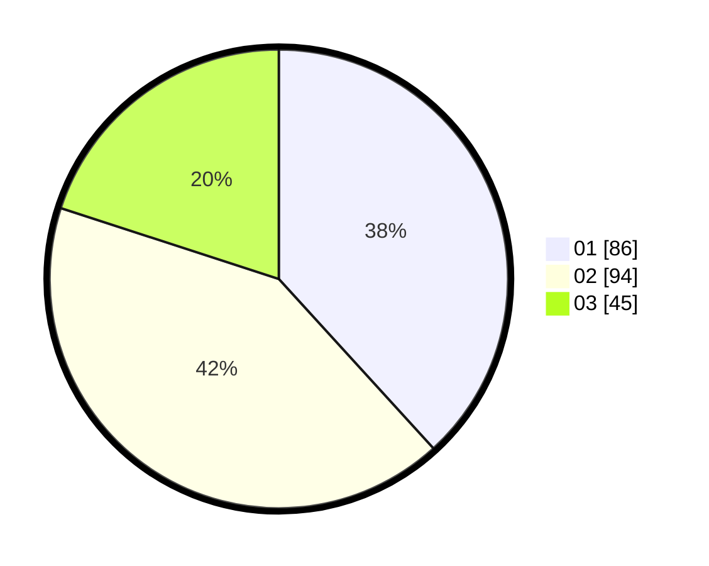

# Hasil

Hasil perolehan suara paslon dapat dilihat pada file paslon-01.txt, paslon-02.txt, dan paslon-03.txt.

Jika tidak ada, artinya data tersebut belum ada pada SIREKAP.

## Perolehan Suara

 * Paslon 01: **86**.
 * Paslon 02: **94**.
 * Paslon 03: **45**.

## Foto C Plano

https://sirekap-obj-formc.kpu.go.id/69c2/pemilu/ppwp/31/73/05/10/07/3173051007047-20240215-013928--757b7254-6f06-454a-9123-a7c609046dca.jpg

https://sirekap-obj-formc.kpu.go.id/69c2/pemilu/ppwp/31/73/05/10/07/3173051007047-20240215-014027--5cd0f9b3-fcbb-480a-82ca-5e36bd53d43f.jpg

https://sirekap-obj-formc.kpu.go.id/69c2/pemilu/ppwp/31/73/05/10/07/3173051007047-20240215-014154--a7360d69-0a36-432d-9571-e7b6c997f455.jpg
