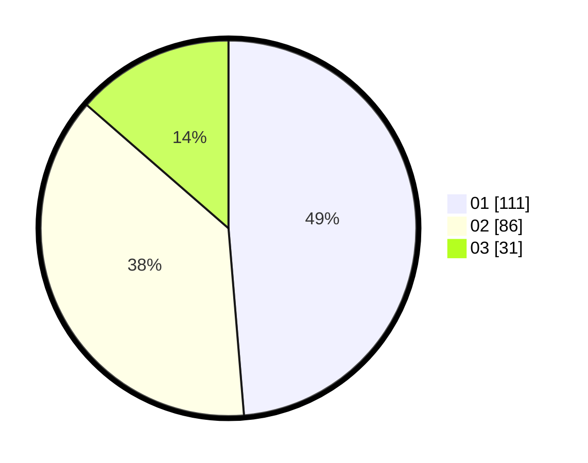

# Hasil

Hasil perolehan suara paslon dapat dilihat pada file paslon-01.txt, paslon-02.txt, dan paslon-03.txt.

Jika tidak ada, artinya data tersebut belum ada pada SIREKAP.

## Perolehan Suara

 * Paslon 01: **111**.
 * Paslon 02: **86**.
 * Paslon 03: **31**.

## Foto C Plano

https://sirekap-obj-formc.kpu.go.id/a401/pemilu/ppwp/31/73/05/10/07/3173051007050-20240214-211058--16b63e59-eea6-4520-8256-9c39e2bae1a7.jpg

https://sirekap-obj-formc.kpu.go.id/a401/pemilu/ppwp/31/73/05/10/07/3173051007050-20240214-211312--39fbc53f-2e4c-4883-a00d-979f9bd7e735.jpg
