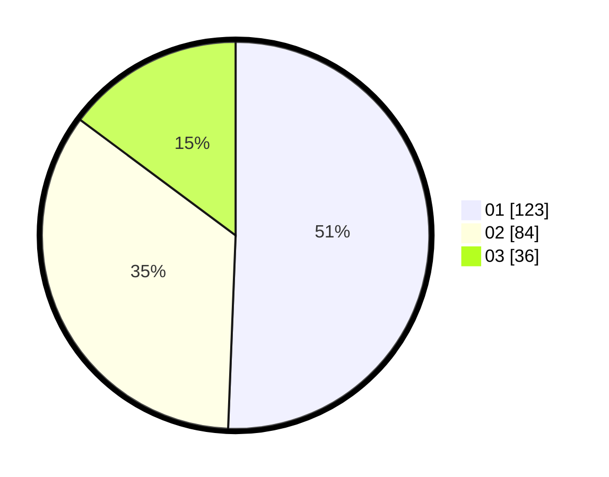

# Hasil

Hasil perolehan suara paslon dapat dilihat pada file paslon-01.txt, paslon-02.txt, dan paslon-03.txt.

Jika tidak ada, artinya data tersebut belum ada pada SIREKAP.

## Perolehan Suara

 * Paslon 01: **123**.
 * Paslon 02: **84**.
 * Paslon 03: **36**.

## Foto C Plano

https://sirekap-obj-formc.kpu.go.id/63c4/pemilu/ppwp/31/73/05/10/07/3173051007053-20240216-080140--6cc0b19b-df16-41ea-abdc-ed32c751896b.jpg

https://sirekap-obj-formc.kpu.go.id/63c4/pemilu/ppwp/31/73/05/10/07/3173051007053-20240216-082458--96f4358e-31d6-4de7-abfc-ef07e69409d3.jpg

https://sirekap-obj-formc.kpu.go.id/63c4/pemilu/ppwp/31/73/05/10/07/3173051007053-20240216-080142--9023795c-5062-40fd-9de2-8d48ac88e4c6.jpg

## DATA PEMILIH TETAP

Jumlah pemilih dalam DPT: **286**.
 * L: **137**.
 * P: **149**.

## DATA PENGGUNA HAK PILIH

Jumlah pengguna hak pilih dalam DPT: **233**.
 * L: **105**.
 * P: **128**.

Jumlah pengguna hak pilih dalam DPTb: **14**.
 * L: **10**.
 * P: **4**.

Jumlah pengguna hak pilih dalam DPK: **0**.
 * L: **0**.
 * P: **0**.

Jumlah pengguna hak pilih: **247**.
 * L: **115**.
 * P: **132**.

## JUMLAH SUARA SAH DAN TIDAK SAH

JUMLAH SELURUH SUARA SAH: **243**.

JUMLAH SUARA TIDAK SAH: **4**.

JUMLAH SELURUH SUARA SAH DAN SUARA TIDAK SAH: **247**.
