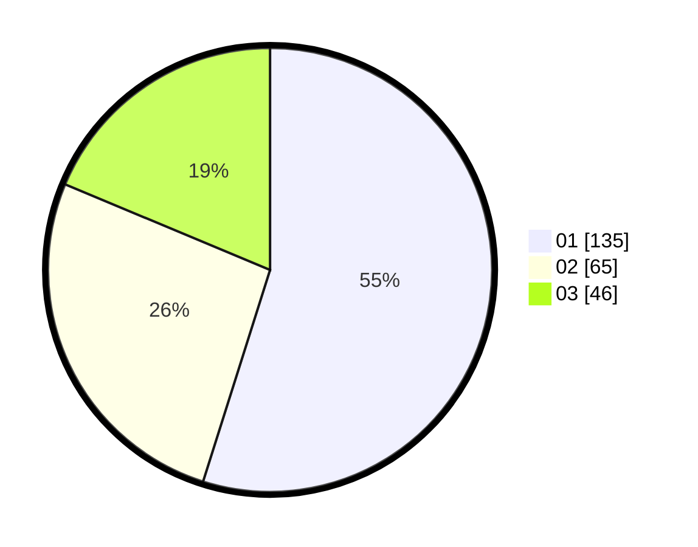

# Hasil

Hasil perolehan suara paslon dapat dilihat pada file paslon-01.txt, paslon-02.txt, dan paslon-03.txt.

Jika tidak ada, artinya data tersebut belum ada pada SIREKAP.

## Perolehan Suara

 * Paslon 01: **135**.
 * Paslon 02: **65**.
 * Paslon 03: **46**.

## Foto C Plano

https://sirekap-obj-formc.kpu.go.id/7e5f/pemilu/ppwp/31/73/05/10/07/3173051007058-20240215-023402--a135a98a-8d9d-408e-8e6c-deecb6282c57.jpg

https://sirekap-obj-formc.kpu.go.id/7e5f/pemilu/ppwp/31/73/05/10/07/3173051007058-20240216-042801--44ae592f-063f-4da3-bbae-4186a3809b47.jpg

https://sirekap-obj-formc.kpu.go.id/7e5f/pemilu/ppwp/31/73/05/10/07/3173051007058-20240216-044057--f75b4328-e887-4417-a287-11a4723c93e3.jpg

## DATA PEMILIH TETAP

Jumlah pemilih dalam DPT: **287**.
 * L: **143**.
 * P: **144**.

## DATA PENGGUNA HAK PILIH

Jumlah pengguna hak pilih dalam DPT: **232**.
 * L: **112**.
 * P: **120**.

Jumlah pengguna hak pilih dalam DPTb: **15**.
 * L: **9**.
 * P: **6**.

Jumlah pengguna hak pilih dalam DPK: **2**.
 * L: **1**.
 * P: **1**.

Jumlah pengguna hak pilih: **249**.
 * L: **122**.
 * P: **127**.

## JUMLAH SUARA SAH DAN TIDAK SAH

JUMLAH SELURUH SUARA SAH: **246**.

JUMLAH SUARA TIDAK SAH: **3**.

JUMLAH SELURUH SUARA SAH DAN SUARA TIDAK SAH: **249**.
