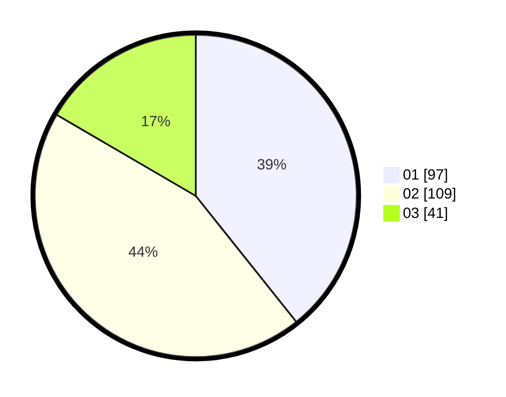

# Hasil

Hasil perolehan suara paslon dapat dilihat pada file paslon-01.txt, paslon-02.txt, dan paslon-03.txt.

Jika tidak ada, artinya data tersebut belum ada pada SIREKAP.

## Perolehan Suara

 * Paslon 01: **97**.
 * Paslon 02: **109**.
 * Paslon 03: **41**.

## Foto C Plano

https://sirekap-obj-formc.kpu.go.id/6919/pemilu/ppwp/31/73/05/10/07/3173051007060-20240217-062545--c79339f3-a40a-4130-bf35-d3fe503f4fe2.jpg

https://sirekap-obj-formc.kpu.go.id/6919/pemilu/ppwp/31/73/05/10/07/3173051007060-20240215-050724--d656f014-e693-45dd-a8ed-da55eadfe1b8.jpg

https://sirekap-obj-formc.kpu.go.id/6919/pemilu/ppwp/31/73/05/10/07/3173051007060-20240217-063311--0f5e09a2-695e-4423-9526-266623cae91c.jpg
