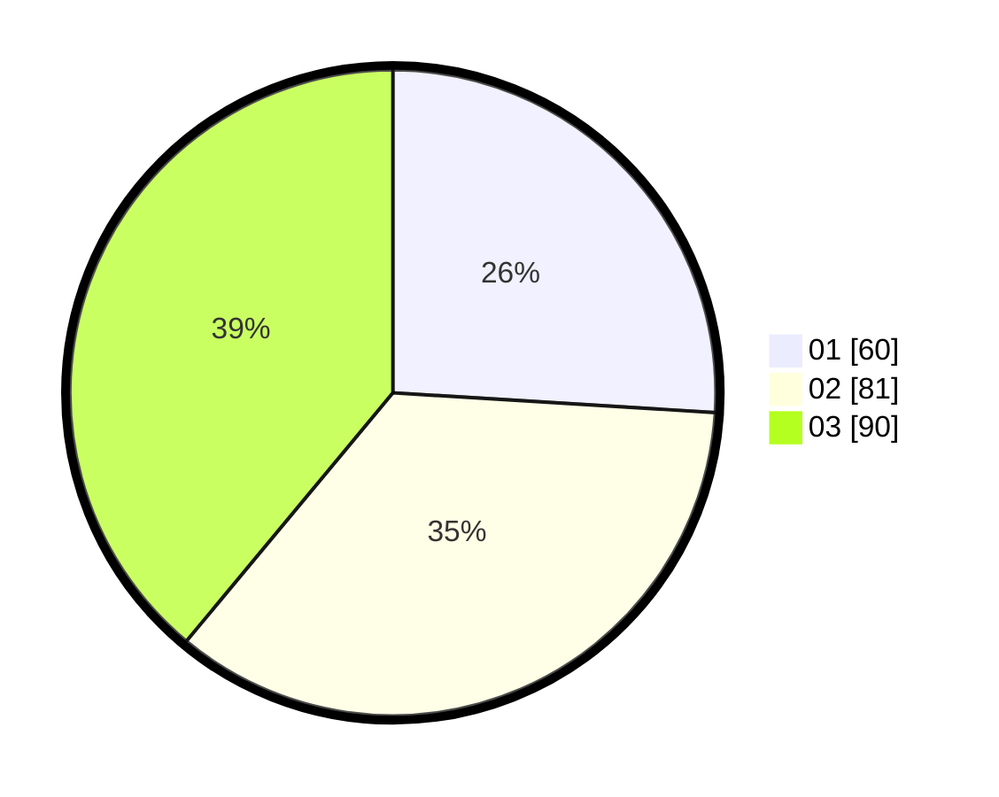

# Hasil

Hasil perolehan suara paslon dapat dilihat pada file paslon-01.txt, paslon-02.txt, dan paslon-03.txt.

Jika tidak ada, artinya data tersebut belum ada pada SIREKAP.

## Perolehan Suara

 * Paslon 01: **60**.
 * Paslon 02: **81**.
 * Paslon 03: **90**.

## Foto C Plano

https://sirekap-obj-formc.kpu.go.id/8a23/pemilu/ppwp/31/73/05/10/07/3173051007063-20240216-143825--01ec47d0-90bb-4115-b6ce-11b0371a1132.jpg

https://sirekap-obj-formc.kpu.go.id/8a23/pemilu/ppwp/31/73/05/10/07/3173051007063-20240216-143826--7b186fd9-4309-49b8-a56c-8a0ce6a91562.jpg

https://sirekap-obj-formc.kpu.go.id/8a23/pemilu/ppwp/31/73/05/10/07/3173051007063-20240216-143825--51ce5c8a-c719-43e2-bbeb-d173b3e00327.jpg

## DATA PEMILIH TETAP

Jumlah pemilih dalam DPT: **284**.
 * L: **137**.
 * P: **147**.

## DATA PENGGUNA HAK PILIH

Jumlah pengguna hak pilih dalam DPT: **218**.
 * L: **101**.
 * P: **117**.

Jumlah pengguna hak pilih dalam DPTb: **17**.
 * L: **1**.
 * P: **16**.

Jumlah pengguna hak pilih dalam DPK: **0**.
 * L: **0**.
 * P: **0**.

Jumlah pengguna hak pilih: **235**.
 * L: **102**.
 * P: **133**.

## JUMLAH SUARA SAH DAN TIDAK SAH

JUMLAH SELURUH SUARA SAH: **231**.

JUMLAH SUARA TIDAK SAH: **4**.

JUMLAH SELURUH SUARA SAH DAN SUARA TIDAK SAH: **235**.
