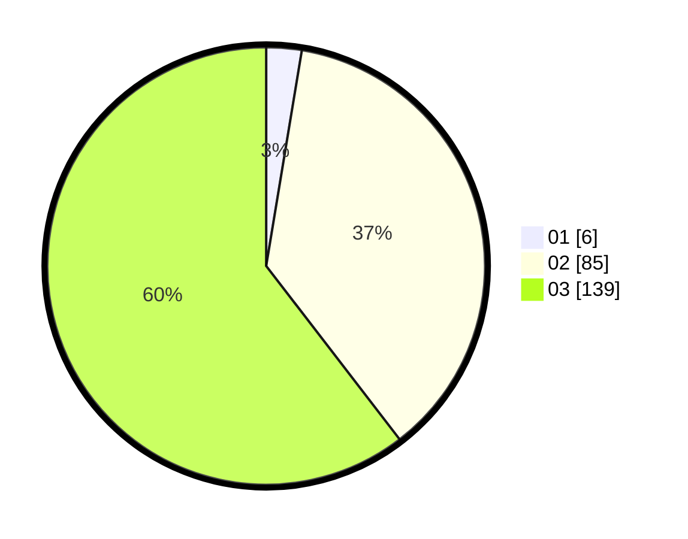

# Hasil

Hasil perolehan suara paslon dapat dilihat pada file paslon-01.txt, paslon-02.txt, dan paslon-03.txt.

Jika tidak ada, artinya data tersebut belum ada pada SIREKAP.

## Perolehan Suara

 * Paslon 01: **6**.
 * Paslon 02: **85**.
 * Paslon 03: **139**.

## Foto C Plano

https://sirekap-obj-formc.kpu.go.id/ac8b/pemilu/ppwp/31/73/05/10/07/3173051007065-20240215-001103--82adde63-9a3b-4211-b1dc-5a746f9f9249.jpg

https://sirekap-obj-formc.kpu.go.id/ac8b/pemilu/ppwp/31/73/05/10/07/3173051007065-20240215-001117--d2cb1160-1620-4077-9c38-6286f09b8772.jpg

https://sirekap-obj-formc.kpu.go.id/ac8b/pemilu/ppwp/31/73/05/10/07/3173051007065-20240215-001344--0aae1fc1-c7fa-40b2-8fa4-7663a8b64ebe.jpg
