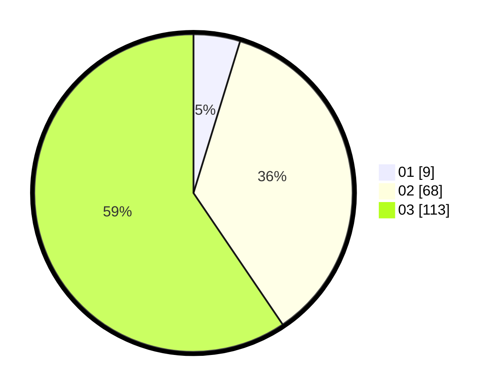

# Hasil

Hasil perolehan suara paslon dapat dilihat pada file paslon-01.txt, paslon-02.txt, dan paslon-03.txt.

Jika tidak ada, artinya data tersebut belum ada pada SIREKAP.

## Perolehan Suara

 * Paslon 01: **9**.
 * Paslon 02: **68**.
 * Paslon 03: **113**.

## Foto C Plano

https://sirekap-obj-formc.kpu.go.id/c58b/pemilu/ppwp/31/73/05/10/07/3173051007068-20240216-022400--f3760477-26f9-4178-8284-67a4e6c890ea.jpg

https://sirekap-obj-formc.kpu.go.id/c58b/pemilu/ppwp/31/73/05/10/07/3173051007068-20240216-022401--86f6b897-a5b1-49aa-aa67-7fa66df66c76.jpg

https://sirekap-obj-formc.kpu.go.id/c58b/pemilu/ppwp/31/73/05/10/07/3173051007068-20240216-022400--98bf2baf-6c10-4c72-959b-26b7845efa8a.jpg

## DATA PEMILIH TETAP

Jumlah pemilih dalam DPT: **222**.
 * L: **100**.
 * P: **122**.

## DATA PENGGUNA HAK PILIH

Jumlah pengguna hak pilih dalam DPT: **177**.
 * L: **81**.
 * P: **96**.

Jumlah pengguna hak pilih dalam DPTb: **13**.
 * L: **4**.
 * P: **9**.

Jumlah pengguna hak pilih dalam DPK: **0**.
 * L: **0**.
 * P: **0**.

Jumlah pengguna hak pilih: **190**.
 * L: **85**.
 * P: **105**.

## JUMLAH SUARA SAH DAN TIDAK SAH

JUMLAH SELURUH SUARA SAH: **190**.

JUMLAH SUARA TIDAK SAH: **0**.

JUMLAH SELURUH SUARA SAH DAN SUARA TIDAK SAH: **190**.
