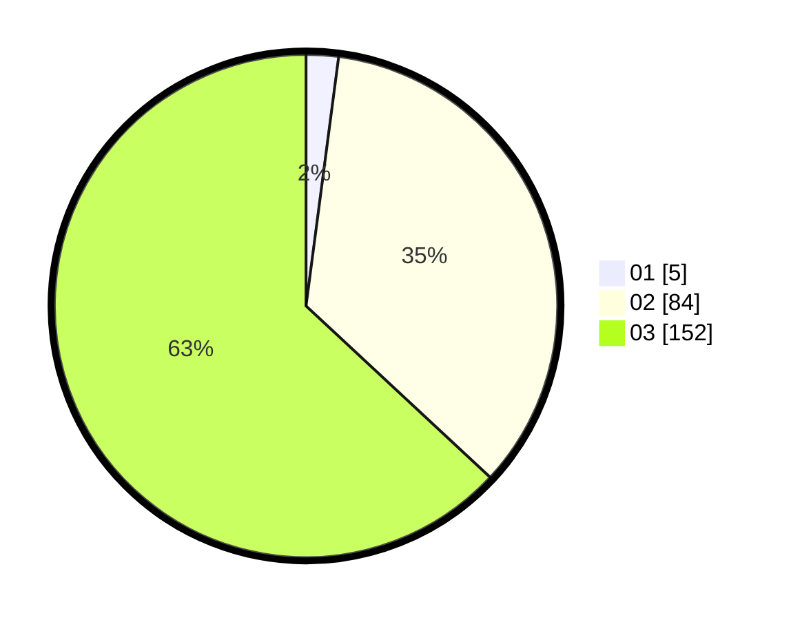

# Hasil

Hasil perolehan suara paslon dapat dilihat pada file paslon-01.txt, paslon-02.txt, dan paslon-03.txt.

Jika tidak ada, artinya data tersebut belum ada pada SIREKAP.

## Perolehan Suara

 * Paslon 01: **5**.
 * Paslon 02: **84**.
 * Paslon 03: **152**.

## Foto C Plano

https://sirekap-obj-formc.kpu.go.id/0939/pemilu/ppwp/31/73/05/10/07/3173051007069-20240217-194151--1dab1e66-628a-47f8-9d06-7ae1c5ec1073.jpg

https://sirekap-obj-formc.kpu.go.id/0939/pemilu/ppwp/31/73/05/10/07/3173051007069-20240217-195652--33707507-0b51-4743-9f05-3b2be250e868.jpg

https://sirekap-obj-formc.kpu.go.id/0939/pemilu/ppwp/31/73/05/10/07/3173051007069-20240217-194301--a2072af8-6e02-44ef-b4af-34b83914a51d.jpg

## DATA PEMILIH TETAP

Jumlah pemilih dalam DPT: **208**.
 * L: **98**.
 * P: **110**.

## DATA PENGGUNA HAK PILIH

Jumlah pengguna hak pilih dalam DPT: **208**.
 * L: **98**.
 * P: **110**.

Jumlah pengguna hak pilih dalam DPTb: **32**.
 * L: **19**.
 * P: **13**.

Jumlah pengguna hak pilih dalam DPK: **9**.
 * L: **6**.
 * P: **3**.

Jumlah pengguna hak pilih: **249**.
 * L: **123**.
 * P: **126**.

## JUMLAH SUARA SAH DAN TIDAK SAH

JUMLAH SELURUH SUARA SAH: **241**.

JUMLAH SUARA TIDAK SAH: **8**.

JUMLAH SELURUH SUARA SAH DAN SUARA TIDAK SAH: **249**.
