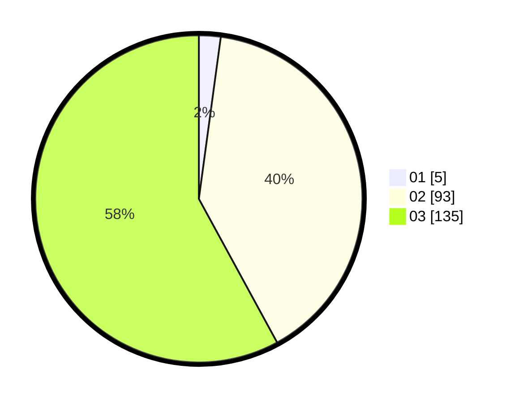

# Hasil

Hasil perolehan suara paslon dapat dilihat pada file paslon-01.txt, paslon-02.txt, dan paslon-03.txt.

Jika tidak ada, artinya data tersebut belum ada pada SIREKAP.

## Perolehan Suara

 * Paslon 01: **5**.
 * Paslon 02: **93**.
 * Paslon 03: **135**.

## Foto C Plano

https://sirekap-obj-formc.kpu.go.id/4415/pemilu/ppwp/31/73/05/10/07/3173051007070-20240214-202301--7bd311d7-a50b-48ec-9aa3-47982e1647b7.jpg

https://sirekap-obj-formc.kpu.go.id/4415/pemilu/ppwp/31/73/05/10/07/3173051007070-20240214-202309--70301316-686a-4a9b-9975-7ff36ce4eb7d.jpg

https://sirekap-obj-formc.kpu.go.id/4415/pemilu/ppwp/31/73/05/10/07/3173051007070-20240214-202314--7bb8027d-4727-419b-86f0-5ae6cd61b9f0.jpg
