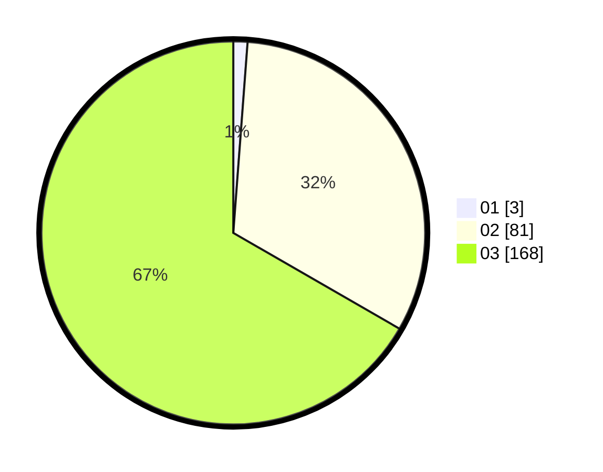

# Hasil

Hasil perolehan suara paslon dapat dilihat pada file paslon-01.txt, paslon-02.txt, dan paslon-03.txt.

Jika tidak ada, artinya data tersebut belum ada pada SIREKAP.

## Perolehan Suara

 * Paslon 01: **3**.
 * Paslon 02: **81**.
 * Paslon 03: **168**.

## Foto C Plano

https://sirekap-obj-formc.kpu.go.id/1564/pemilu/ppwp/31/73/05/10/07/3173051007073-20240217-140544--5666b730-ac0a-4671-be83-2bf10de0d583.jpg

https://sirekap-obj-formc.kpu.go.id/1564/pemilu/ppwp/31/73/05/10/07/3173051007073-20240217-143343--8e9f0665-1308-4cb2-8eaa-092e3a5cfa0b.jpg

https://sirekap-obj-formc.kpu.go.id/1564/pemilu/ppwp/31/73/05/10/07/3173051007073-20240217-143735--07a2d4d6-1a49-4c09-baac-390a5fd266e1.jpg

## DATA PEMILIH TETAP

Jumlah pemilih dalam DPT: **284**.
 * L: **126**.
 * P: **158**.

## DATA PENGGUNA HAK PILIH

Jumlah pengguna hak pilih dalam DPT: **210**.
 * L: **95**.
 * P: **115**.

Jumlah pengguna hak pilih dalam DPTb: **19**.
 * L: **5**.
 * P: **14**.

Jumlah pengguna hak pilih dalam DPK: **29**.
 * L: **7**.
 * P: **22**.

Jumlah pengguna hak pilih: **258**.
 * L: **107**.
 * P: **151**.

## JUMLAH SUARA SAH DAN TIDAK SAH

JUMLAH SELURUH SUARA SAH: **252**.

JUMLAH SUARA TIDAK SAH: **6**.

JUMLAH SELURUH SUARA SAH DAN SUARA TIDAK SAH: **258**.
