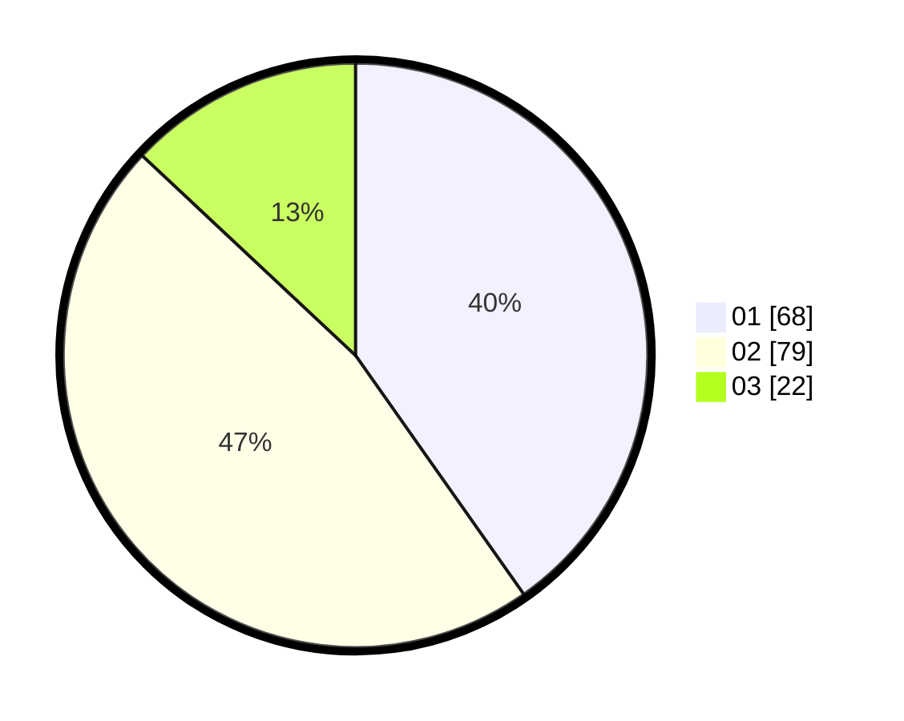

# Hasil

Hasil perolehan suara paslon dapat dilihat pada file paslon-01.txt, paslon-02.txt, dan paslon-03.txt.

Jika tidak ada, artinya data tersebut belum ada pada SIREKAP.

## Perolehan Suara

 * Paslon 01: **68**.
 * Paslon 02: **79**.
 * Paslon 03: **22**.

## Foto C Plano

https://sirekap-obj-formc.kpu.go.id/f46b/pemilu/ppwp/31/73/05/10/07/3173051007081-20240214-222019--2887b55f-ddd0-4d8f-a208-5eb6adc850b8.jpg

https://sirekap-obj-formc.kpu.go.id/f46b/pemilu/ppwp/31/73/05/10/07/3173051007081-20240214-222047--9f14d75f-dc75-44e0-954a-771c3f964f5e.jpg

https://sirekap-obj-formc.kpu.go.id/f46b/pemilu/ppwp/31/73/05/10/07/3173051007081-20240214-222122--589ef6cb-8852-44ff-9646-fabddcf5113b.jpg

## DATA PEMILIH TETAP

Jumlah pemilih dalam DPT: **217**.
 * L: **104**.
 * P: **113**.

## DATA PENGGUNA HAK PILIH

Jumlah pengguna hak pilih dalam DPT: **174**.
 * L: **77**.
 * P: **97**.

Jumlah pengguna hak pilih dalam DPTb: **0**.
 * L: **0**.
 * P: **0**.

Jumlah pengguna hak pilih dalam DPK: **0**.
 * L: **0**.
 * P: **0**.

Jumlah pengguna hak pilih: **174**.
 * L: **77**.
 * P: **97**.

## JUMLAH SUARA SAH DAN TIDAK SAH

JUMLAH SELURUH SUARA SAH: **169**.

JUMLAH SUARA TIDAK SAH: **5**.

JUMLAH SELURUH SUARA SAH DAN SUARA TIDAK SAH: **174**.
