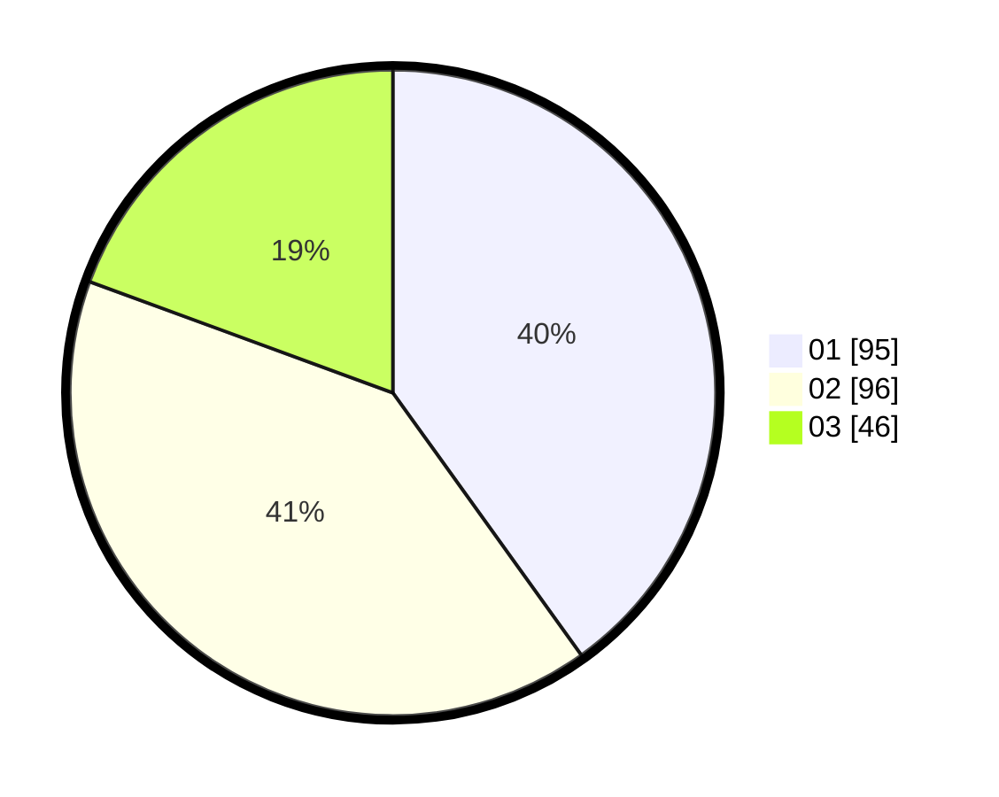

# Hasil

Hasil perolehan suara paslon dapat dilihat pada file paslon-01.txt, paslon-02.txt, dan paslon-03.txt.

Jika tidak ada, artinya data tersebut belum ada pada SIREKAP.

## Perolehan Suara

 * Paslon 01: **95**.
 * Paslon 02: **96**.
 * Paslon 03: **46**.

## Foto C Plano

https://sirekap-obj-formc.kpu.go.id/988a/pemilu/ppwp/31/73/05/10/07/3173051007082-20240214-215443--054de51f-e9c2-43f9-9dbd-35e0cfd1fb98.jpg

https://sirekap-obj-formc.kpu.go.id/988a/pemilu/ppwp/31/73/05/10/07/3173051007082-20240214-215652--05b97a7d-9342-4271-a766-1c011152b68c.jpg

https://sirekap-obj-formc.kpu.go.id/988a/pemilu/ppwp/31/73/05/10/07/3173051007082-20240214-215803--46f71ada-a92f-4e39-9820-12139727c37c.jpg
