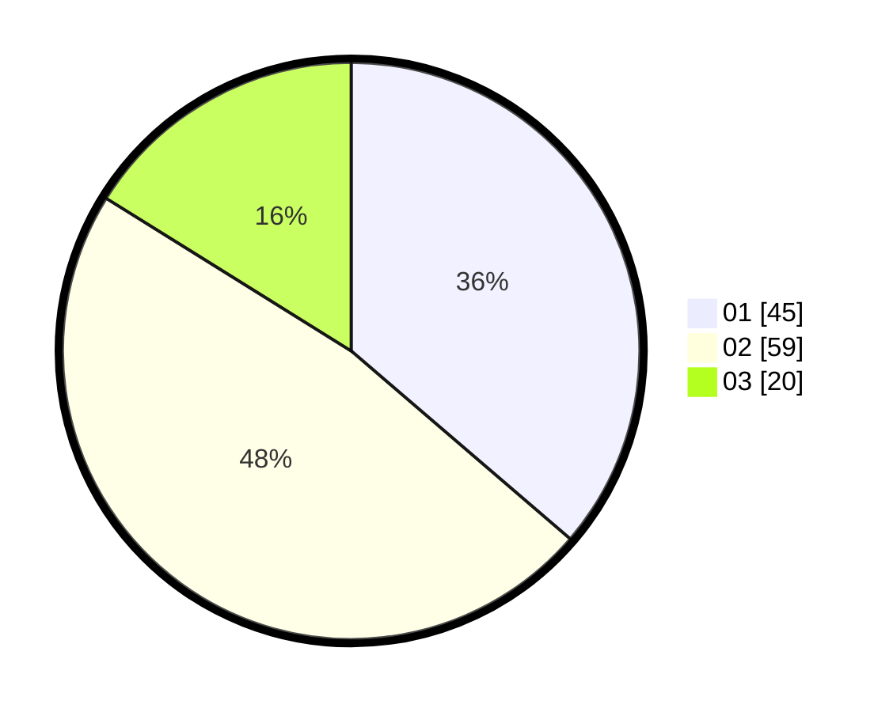

# Hasil

Hasil perolehan suara paslon dapat dilihat pada file paslon-01.txt, paslon-02.txt, dan paslon-03.txt.

Jika tidak ada, artinya data tersebut belum ada pada SIREKAP.

## Perolehan Suara

 * Paslon 01: **45**.
 * Paslon 02: **59**.
 * Paslon 03: **20**.

## Foto C Plano

https://sirekap-obj-formc.kpu.go.id/a15a/pemilu/ppwp/31/73/05/10/07/3173051007085-20240214-211519--e5c4bc74-3907-404f-a3f5-ab77af963143.jpg

https://sirekap-obj-formc.kpu.go.id/a15a/pemilu/ppwp/31/73/05/10/07/3173051007085-20240216-010427--268b71cb-9ddb-42f4-b66e-3e0a9c0d89d3.jpg

https://sirekap-obj-formc.kpu.go.id/a15a/pemilu/ppwp/31/73/05/10/07/3173051007085-20240214-212125--b26f3adb-4cb0-4525-89c5-f55e740de9e9.jpg

## DATA PEMILIH TETAP

Jumlah pemilih dalam DPT: **188**.
 * L: **88**.
 * P: **100**.

## DATA PENGGUNA HAK PILIH

Jumlah pengguna hak pilih dalam DPT: **127**.
 * L: **54**.
 * P: **73**.

Jumlah pengguna hak pilih dalam DPTb: **0**.
 * L: **0**.
 * P: **0**.

Jumlah pengguna hak pilih dalam DPK: **0**.
 * L: **0**.
 * P: **0**.

Jumlah pengguna hak pilih: **127**.
 * L: **54**.
 * P: **73**.

## JUMLAH SUARA SAH DAN TIDAK SAH

JUMLAH SELURUH SUARA SAH: **124**.

JUMLAH SUARA TIDAK SAH: **3**.

JUMLAH SELURUH SUARA SAH DAN SUARA TIDAK SAH: **127**.
