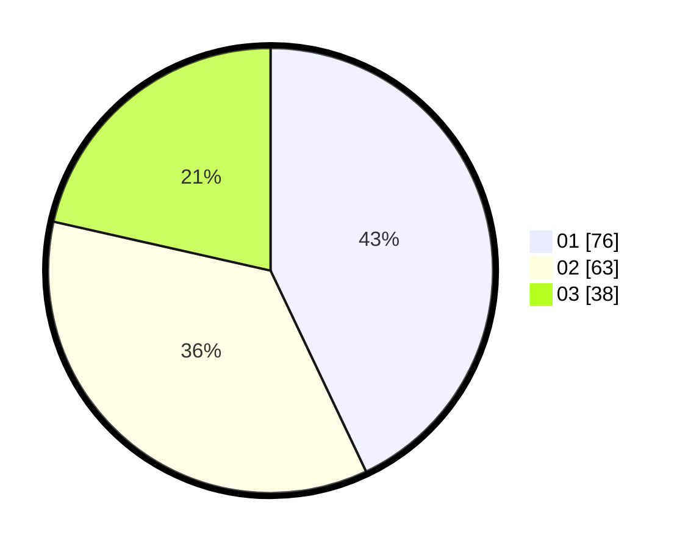

# Hasil

Hasil perolehan suara paslon dapat dilihat pada file paslon-01.txt, paslon-02.txt, dan paslon-03.txt.

Jika tidak ada, artinya data tersebut belum ada pada SIREKAP.

## Perolehan Suara

 * Paslon 01: **76**.
 * Paslon 02: **63**.
 * Paslon 03: **38**.

## Foto C Plano

https://sirekap-obj-formc.kpu.go.id/5cae/pemilu/ppwp/31/73/05/10/07/3173051007086-20240217-122232--cff9a476-e766-4d92-8f7a-44a0246be37b.jpg

https://sirekap-obj-formc.kpu.go.id/5cae/pemilu/ppwp/31/73/05/10/07/3173051007086-20240217-135603--c3b27e6e-39d1-4a41-b41c-1ba60be14760.jpg

https://sirekap-obj-formc.kpu.go.id/5cae/pemilu/ppwp/31/73/05/10/07/3173051007086-20240217-124517--5842ea03-127a-4c66-ae34-8bd0900f7672.jpg
