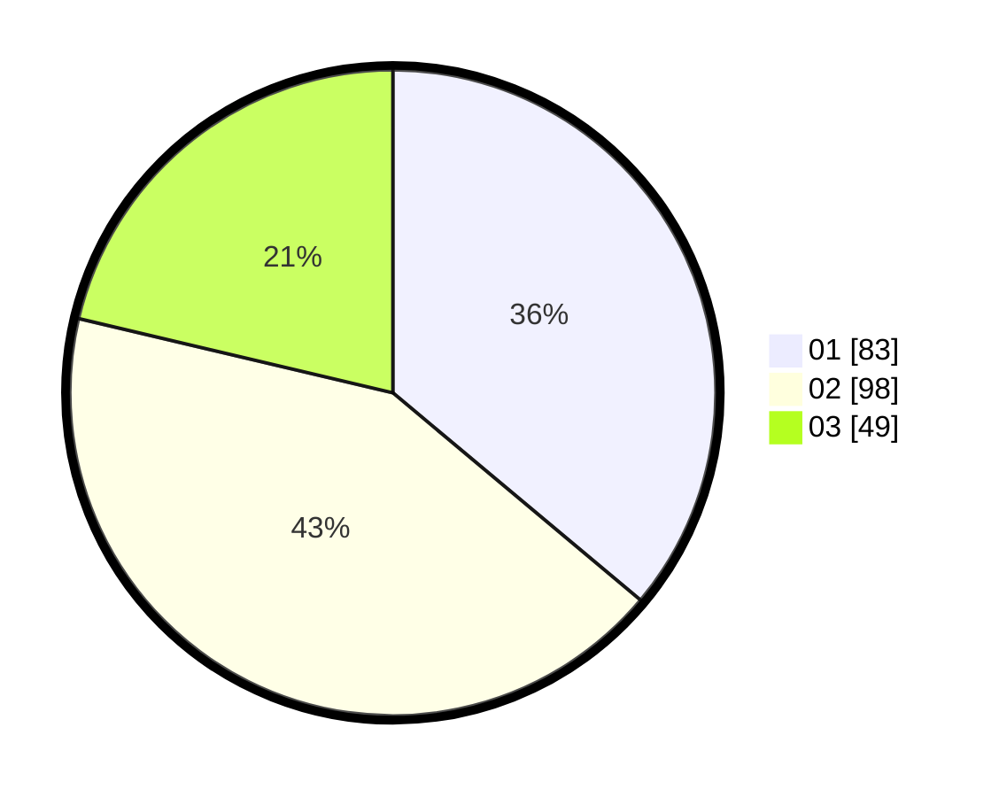

# Hasil

Hasil perolehan suara paslon dapat dilihat pada file paslon-01.txt, paslon-02.txt, dan paslon-03.txt.

Jika tidak ada, artinya data tersebut belum ada pada SIREKAP.

## Perolehan Suara

 * Paslon 01: **83**.
 * Paslon 02: **98**.
 * Paslon 03: **49**.

## Foto C Plano

https://sirekap-obj-formc.kpu.go.id/43e1/pemilu/ppwp/31/73/05/10/07/3173051007090-20240217-111223--4c529406-b5c8-4508-981b-6c2549932d71.jpg

https://sirekap-obj-formc.kpu.go.id/43e1/pemilu/ppwp/31/73/05/10/07/3173051007090-20240217-111224--9a1f7a33-042c-4586-a093-6960f6874735.jpg

https://sirekap-obj-formc.kpu.go.id/43e1/pemilu/ppwp/31/73/05/10/07/3173051007090-20240217-111224--3c51fe48-cde0-4df6-b523-6135456b8169.jpg

## DATA PEMILIH TETAP

Jumlah pemilih dalam DPT: **282**.
 * L: **140**.
 * P: **142**.

## DATA PENGGUNA HAK PILIH

Jumlah pengguna hak pilih dalam DPT: **233**.
 * L: **113**.
 * P: **120**.

Jumlah pengguna hak pilih dalam DPTb: **0**.
 * L: **0**.
 * P: **0**.

Jumlah pengguna hak pilih dalam DPK: **0**.
 * L: **0**.
 * P: **0**.

Jumlah pengguna hak pilih: **233**.
 * L: **113**.
 * P: **120**.

## JUMLAH SUARA SAH DAN TIDAK SAH

JUMLAH SELURUH SUARA SAH: **230**.

JUMLAH SUARA TIDAK SAH: **3**.

JUMLAH SELURUH SUARA SAH DAN SUARA TIDAK SAH: **233**.
