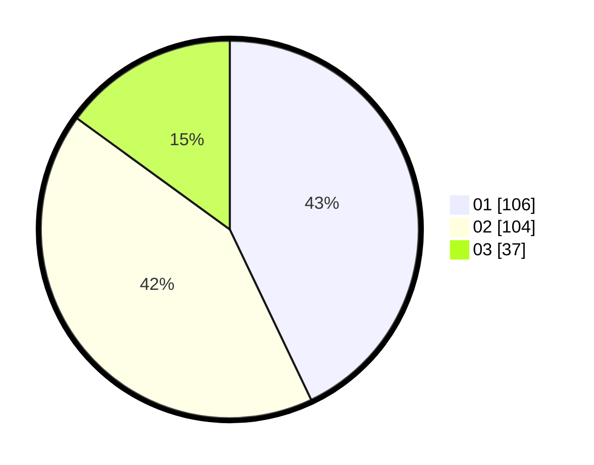

# Hasil

Hasil perolehan suara paslon dapat dilihat pada file paslon-01.txt, paslon-02.txt, dan paslon-03.txt.

Jika tidak ada, artinya data tersebut belum ada pada SIREKAP.

## Perolehan Suara

 * Paslon 01: **106**.
 * Paslon 02: **104**.
 * Paslon 03: **37**.

## Foto C Plano

https://sirekap-obj-formc.kpu.go.id/51ae/pemilu/ppwp/31/73/05/10/07/3173051007091-20240214-185851--e18715f6-3de0-4146-a44c-0d6e8925be0f.jpg

https://sirekap-obj-formc.kpu.go.id/51ae/pemilu/ppwp/31/73/05/10/07/3173051007091-20240214-210507--285b90df-5055-43e5-95e7-3706415e969f.jpg

https://sirekap-obj-formc.kpu.go.id/51ae/pemilu/ppwp/31/73/05/10/07/3173051007091-20240214-210052--3c8c37a8-10f4-46b5-a996-8f27fe17c08c.jpg

## DATA PEMILIH TETAP

Jumlah pemilih dalam DPT: **276**.
 * L: **142**.
 * P: **134**.

## DATA PENGGUNA HAK PILIH

Jumlah pengguna hak pilih dalam DPT: **244**.
 * L: **127**.
 * P: **117**.

Jumlah pengguna hak pilih dalam DPTb: **2**.
 * L: **2**.
 * P: **0**.

Jumlah pengguna hak pilih dalam DPK: **4**.
 * L: **1**.
 * P: **3**.

Jumlah pengguna hak pilih: **250**.
 * L: **130**.
 * P: **120**.

## JUMLAH SUARA SAH DAN TIDAK SAH

JUMLAH SELURUH SUARA SAH: **247**.

JUMLAH SUARA TIDAK SAH: **3**.

JUMLAH SELURUH SUARA SAH DAN SUARA TIDAK SAH: **250**.
