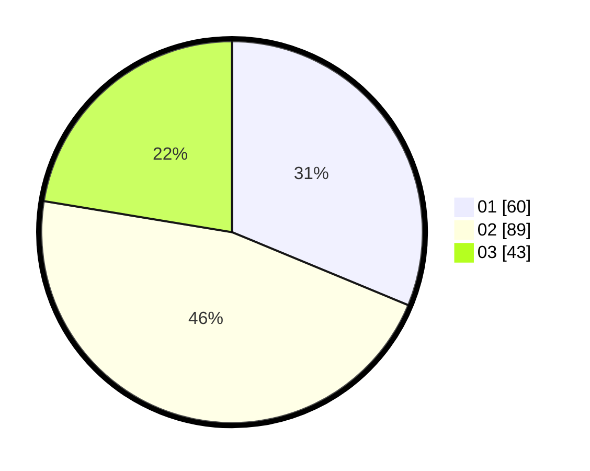

# Hasil

Hasil perolehan suara paslon dapat dilihat pada file paslon-01.txt, paslon-02.txt, dan paslon-03.txt.

Jika tidak ada, artinya data tersebut belum ada pada SIREKAP.

## Perolehan Suara

 * Paslon 01: **60**.
 * Paslon 02: **89**.
 * Paslon 03: **43**.

## Foto C Plano

https://sirekap-obj-formc.kpu.go.id/9a21/pemilu/ppwp/31/73/05/10/07/3173051007097-20240218-115443--8a33fcb8-c383-4224-b846-d64f81bb676f.jpg

https://sirekap-obj-formc.kpu.go.id/9a21/pemilu/ppwp/31/73/05/10/07/3173051007097-20240218-115445--8f2ea9ce-a99b-49b3-a118-3f29641b70eb.jpg

https://sirekap-obj-formc.kpu.go.id/9a21/pemilu/ppwp/31/73/05/10/07/3173051007097-20240218-115444--46eb6b3b-0876-41e2-8e6f-c7700fca0733.jpg

## DATA PEMILIH TETAP

Jumlah pemilih dalam DPT: **258**.
 * L: **131**.
 * P: **127**.

## DATA PENGGUNA HAK PILIH

Jumlah pengguna hak pilih dalam DPT: **188**.
 * L: **93**.
 * P: **95**.

Jumlah pengguna hak pilih dalam DPTb: **12**.
 * L: **8**.
 * P: **4**.

Jumlah pengguna hak pilih dalam DPK: **1**.
 * L: **0**.
 * P: **1**.

Jumlah pengguna hak pilih: **201**.
 * L: **101**.
 * P: **100**.

## JUMLAH SUARA SAH DAN TIDAK SAH

JUMLAH SELURUH SUARA SAH: **192**.

JUMLAH SUARA TIDAK SAH: **9**.

JUMLAH SELURUH SUARA SAH DAN SUARA TIDAK SAH: **201**.
