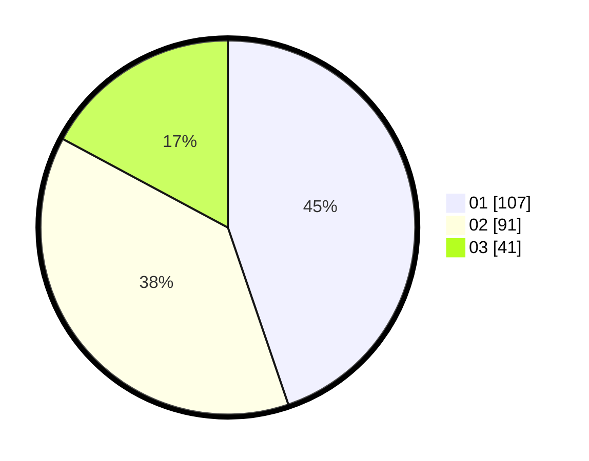

# Hasil

Hasil perolehan suara paslon dapat dilihat pada file paslon-01.txt, paslon-02.txt, dan paslon-03.txt.

Jika tidak ada, artinya data tersebut belum ada pada SIREKAP.

## Perolehan Suara

 * Paslon 01: **107**.
 * Paslon 02: **91**.
 * Paslon 03: **41**.

## Foto C Plano

https://sirekap-obj-formc.kpu.go.id/6a05/pemilu/ppwp/31/73/05/10/07/3173051007098-20240216-035511--880bb03e-7577-4990-8a72-0e054b66d52f.jpg

https://sirekap-obj-formc.kpu.go.id/6a05/pemilu/ppwp/31/73/05/10/07/3173051007098-20240216-035522--b051cef7-b129-4163-8a7a-58ee1b1b2e1b.jpg

https://sirekap-obj-formc.kpu.go.id/6a05/pemilu/ppwp/31/73/05/10/07/3173051007098-20240216-035515--a7a1729a-7453-48c1-836e-089404f04bdc.jpg

## DATA PEMILIH TETAP

Jumlah pemilih dalam DPT: **284**.
 * L: **142**.
 * P: **142**.

## DATA PENGGUNA HAK PILIH

Jumlah pengguna hak pilih dalam DPT: **228**.
 * L: **111**.
 * P: **117**.

Jumlah pengguna hak pilih dalam DPTb: **13**.
 * L: **1**.
 * P: **12**.

Jumlah pengguna hak pilih dalam DPK: **2**.
 * L: **1**.
 * P: **1**.

Jumlah pengguna hak pilih: **243**.
 * L: **113**.
 * P: **130**.

## JUMLAH SUARA SAH DAN TIDAK SAH

JUMLAH SELURUH SUARA SAH: **239**.

JUMLAH SUARA TIDAK SAH: **4**.

JUMLAH SELURUH SUARA SAH DAN SUARA TIDAK SAH: **243**.
