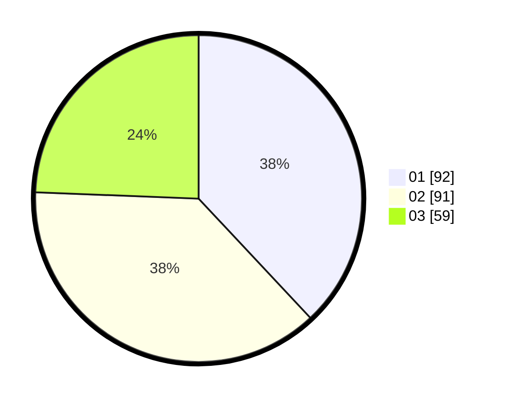

# Hasil

Hasil perolehan suara paslon dapat dilihat pada file paslon-01.txt, paslon-02.txt, dan paslon-03.txt.

Jika tidak ada, artinya data tersebut belum ada pada SIREKAP.

## Perolehan Suara

 * Paslon 01: **92**.
 * Paslon 02: **91**.
 * Paslon 03: **59**.

## Foto C Plano

https://sirekap-obj-formc.kpu.go.id/ba68/pemilu/ppwp/31/73/05/10/07/3173051007099-20240216-231645--e5313e2d-630b-41d5-a170-4a979abbc61d.jpg

https://sirekap-obj-formc.kpu.go.id/ba68/pemilu/ppwp/31/73/05/10/07/3173051007099-20240216-231647--441706b2-2797-4ce7-9e7a-7a168cc9dd85.jpg

https://sirekap-obj-formc.kpu.go.id/ba68/pemilu/ppwp/31/73/05/10/07/3173051007099-20240216-231646--98370b1f-1332-44b1-8104-160bb26d49ec.jpg

## DATA PEMILIH TETAP

Jumlah pemilih dalam DPT: **289**.
 * L: **150**.
 * P: **139**.

## DATA PENGGUNA HAK PILIH

Jumlah pengguna hak pilih dalam DPT: **221**.
 * L: **115**.
 * P: **106**.

Jumlah pengguna hak pilih dalam DPTb: **14**.
 * L: **9**.
 * P: **5**.

Jumlah pengguna hak pilih dalam DPK: **8**.
 * L: **3**.
 * P: **5**.

Jumlah pengguna hak pilih: **243**.
 * L: **127**.
 * P: **116**.

## JUMLAH SUARA SAH DAN TIDAK SAH

JUMLAH SELURUH SUARA SAH: **242**.

JUMLAH SUARA TIDAK SAH: **1**.

JUMLAH SELURUH SUARA SAH DAN SUARA TIDAK SAH: **243**.
