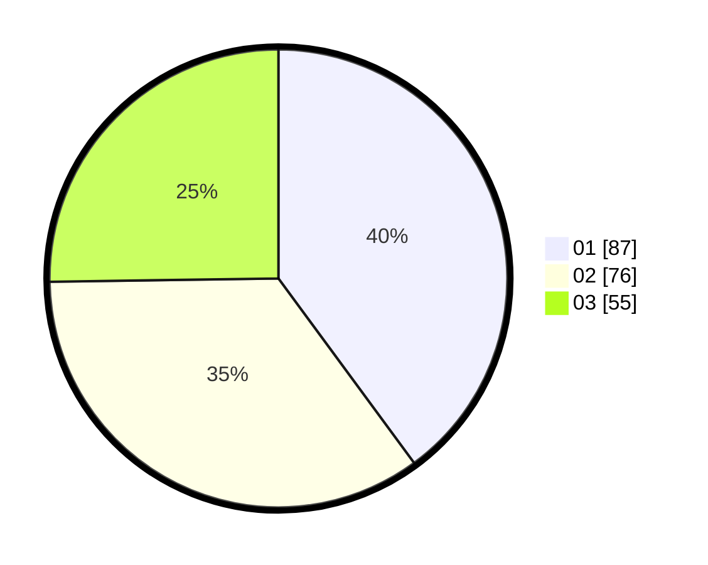

# Hasil

Hasil perolehan suara paslon dapat dilihat pada file paslon-01.txt, paslon-02.txt, dan paslon-03.txt.

Jika tidak ada, artinya data tersebut belum ada pada SIREKAP.

## Perolehan Suara

 * Paslon 01: **87**.
 * Paslon 02: **76**.
 * Paslon 03: **55**.

## Foto C Plano

https://sirekap-obj-formc.kpu.go.id/c80f/pemilu/ppwp/31/73/05/10/07/3173051007101-20240216-052140--a8c2b429-3328-4a0a-a5a6-377deedf2e39.jpg

https://sirekap-obj-formc.kpu.go.id/c80f/pemilu/ppwp/31/73/05/10/07/3173051007101-20240216-052148--d080c168-8671-4a62-9358-c01ba51ef872.jpg

https://sirekap-obj-formc.kpu.go.id/c80f/pemilu/ppwp/31/73/05/10/07/3173051007101-20240216-052141--25523a1b-e13c-4a06-a595-6f7869fd6195.jpg

## DATA PEMILIH TETAP

Jumlah pemilih dalam DPT: **269**.
 * L: **125**.
 * P: **144**.

## DATA PENGGUNA HAK PILIH

Jumlah pengguna hak pilih dalam DPT: **199**.
 * L: **92**.
 * P: **107**.

Jumlah pengguna hak pilih dalam DPTb: **15**.
 * L: **2**.
 * P: **13**.

Jumlah pengguna hak pilih dalam DPK: **8**.
 * L: **2**.
 * P: **6**.

Jumlah pengguna hak pilih: **222**.
 * L: **96**.
 * P: **126**.

## JUMLAH SUARA SAH DAN TIDAK SAH

JUMLAH SELURUH SUARA SAH: **218**.

JUMLAH SUARA TIDAK SAH: **4**.

JUMLAH SELURUH SUARA SAH DAN SUARA TIDAK SAH: **222**.
