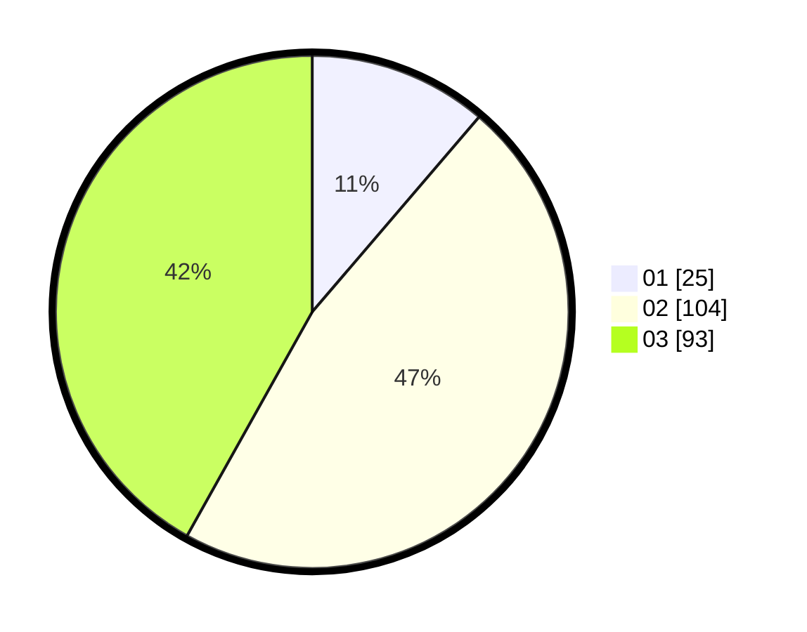

# Hasil

Hasil perolehan suara paslon dapat dilihat pada file paslon-01.txt, paslon-02.txt, dan paslon-03.txt.

Jika tidak ada, artinya data tersebut belum ada pada SIREKAP.

## Perolehan Suara

 * Paslon 01: **25**.
 * Paslon 02: **104**.
 * Paslon 03: **93**.

## Foto C Plano

https://sirekap-obj-formc.kpu.go.id/0462/pemilu/ppwp/31/73/05/10/07/3173051007103-20240214-185018--33973bc5-dc24-4706-90bf-8deaafb01386.jpg

https://sirekap-obj-formc.kpu.go.id/0462/pemilu/ppwp/31/73/05/10/07/3173051007103-20240214-184819--074a9f39-1c10-4a8f-9280-bb00bea4e019.jpg

https://sirekap-obj-formc.kpu.go.id/0462/pemilu/ppwp/31/73/05/10/07/3173051007103-20240214-185408--d3d9d300-e760-4759-baef-e7329c459dfd.jpg

## DATA PEMILIH TETAP

Jumlah pemilih dalam DPT: **285**.
 * L: **137**.
 * P: **148**.

## DATA PENGGUNA HAK PILIH

Jumlah pengguna hak pilih dalam DPT: **206**.
 * L: **98**.
 * P: **108**.

Jumlah pengguna hak pilih dalam DPTb: **15**.
 * L: **2**.
 * P: **13**.

Jumlah pengguna hak pilih dalam DPK: **3**.
 * L: **1**.
 * P: **2**.

Jumlah pengguna hak pilih: **224**.
 * L: **101**.
 * P: **123**.

## JUMLAH SUARA SAH DAN TIDAK SAH

JUMLAH SELURUH SUARA SAH: **222**.

JUMLAH SUARA TIDAK SAH: **2**.

JUMLAH SELURUH SUARA SAH DAN SUARA TIDAK SAH: **224**.
