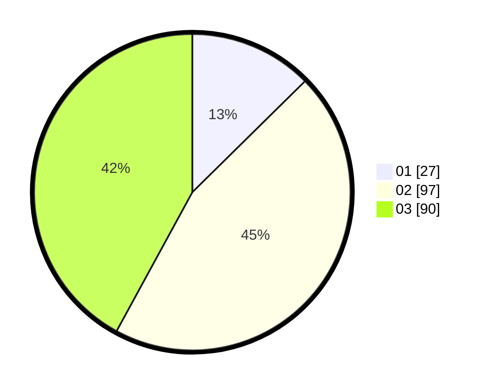

# Hasil

Hasil perolehan suara paslon dapat dilihat pada file paslon-01.txt, paslon-02.txt, dan paslon-03.txt.

Jika tidak ada, artinya data tersebut belum ada pada SIREKAP.

## Perolehan Suara

 * Paslon 01: **27**.
 * Paslon 02: **97**.
 * Paslon 03: **90**.

## Foto C Plano

https://sirekap-obj-formc.kpu.go.id/79fe/pemilu/ppwp/31/73/05/10/07/3173051007104-20240217-114934--d8abe9f0-644a-4b9b-88fc-46dac7efdc8f.jpg

https://sirekap-obj-formc.kpu.go.id/79fe/pemilu/ppwp/31/73/05/10/07/3173051007104-20240217-120044--f67ae83f-5128-4e2e-a9bc-1e7554d65d19.jpg

https://sirekap-obj-formc.kpu.go.id/79fe/pemilu/ppwp/31/73/05/10/07/3173051007104-20240218-103813--537a7583-df16-4ac7-9952-0525e7c2a914.jpg

## DATA PEMILIH TETAP

Jumlah pemilih dalam DPT: **280**.
 * L: **129**.
 * P: **151**.

## DATA PENGGUNA HAK PILIH

Jumlah pengguna hak pilih dalam DPT: **204**.
 * L: **95**.
 * P: **109**.

Jumlah pengguna hak pilih dalam DPTb: **12**.
 * L: **4**.
 * P: **8**.

Jumlah pengguna hak pilih dalam DPK: **0**.
 * L: **0**.
 * P: **0**.

Jumlah pengguna hak pilih: **216**.
 * L: **99**.
 * P: **117**.

## JUMLAH SUARA SAH DAN TIDAK SAH

JUMLAH SELURUH SUARA SAH: **214**.

JUMLAH SUARA TIDAK SAH: **2**.

JUMLAH SELURUH SUARA SAH DAN SUARA TIDAK SAH: **216**.
