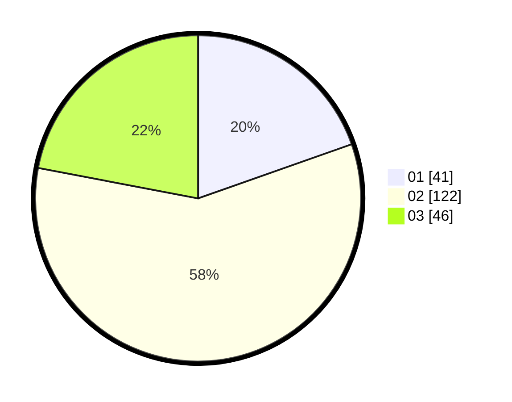

# Hasil

Hasil perolehan suara paslon dapat dilihat pada file paslon-01.txt, paslon-02.txt, dan paslon-03.txt.

Jika tidak ada, artinya data tersebut belum ada pada SIREKAP.

## Perolehan Suara

 * Paslon 01: **41**.
 * Paslon 02: **122**.
 * Paslon 03: **46**.

## Foto C Plano

https://sirekap-obj-formc.kpu.go.id/d377/pemilu/ppwp/31/73/05/10/07/3173051007105-20240214-212642--4412adbf-4b66-48ee-8390-bf38f54b85b3.jpg

https://sirekap-obj-formc.kpu.go.id/d377/pemilu/ppwp/31/73/05/10/07/3173051007105-20240214-212741--bedad2d4-cbd6-45fa-901a-8bc6784fd015.jpg

https://sirekap-obj-formc.kpu.go.id/d377/pemilu/ppwp/31/73/05/10/07/3173051007105-20240214-212825--3e331cd8-279a-4c26-a35d-ecd1d5d67141.jpg

## DATA PEMILIH TETAP

Jumlah pemilih dalam DPT: **262**.
 * L: **130**.
 * P: **132**.

## DATA PENGGUNA HAK PILIH

Jumlah pengguna hak pilih dalam DPT: **205**.
 * L: **93**.
 * P: **112**.

Jumlah pengguna hak pilih dalam DPTb: **5**.
 * L: **3**.
 * P: **2**.

Jumlah pengguna hak pilih dalam DPK: **2**.
 * L: **2**.
 * P: **0**.

Jumlah pengguna hak pilih: **212**.
 * L: **98**.
 * P: **114**.

## JUMLAH SUARA SAH DAN TIDAK SAH

JUMLAH SELURUH SUARA SAH: **209**.

JUMLAH SUARA TIDAK SAH: **3**.

JUMLAH SELURUH SUARA SAH DAN SUARA TIDAK SAH: **212**.
